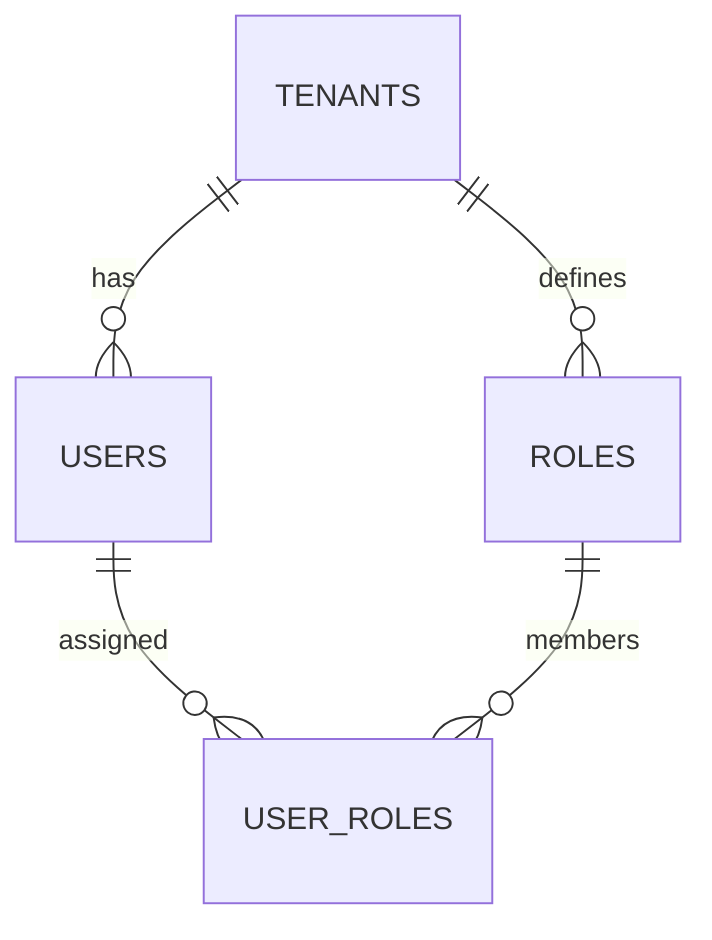
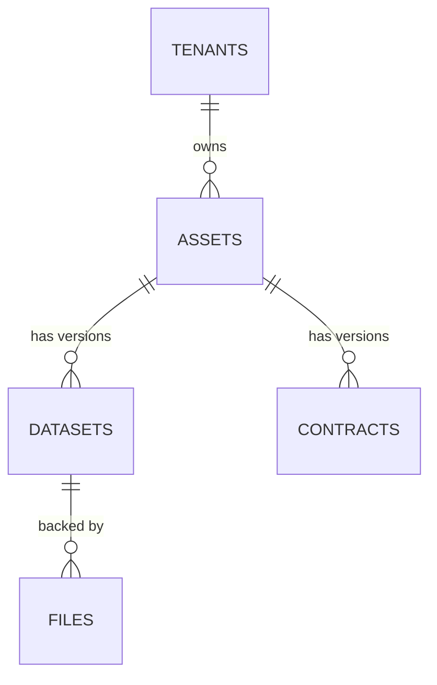
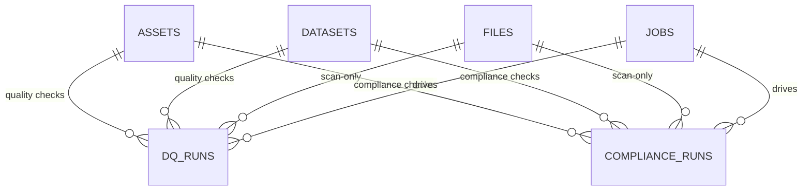
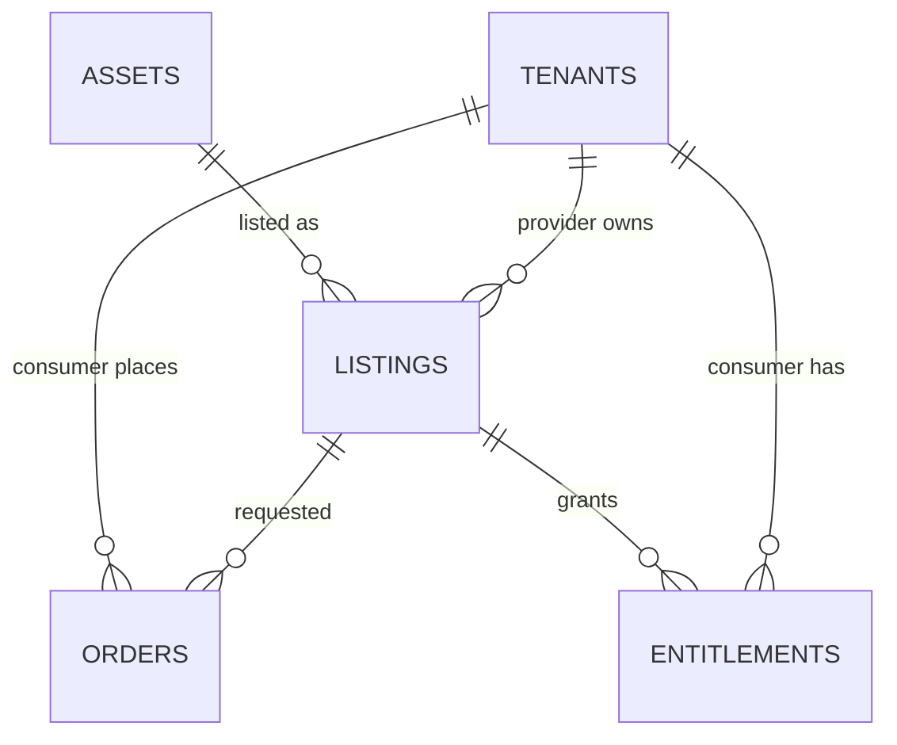
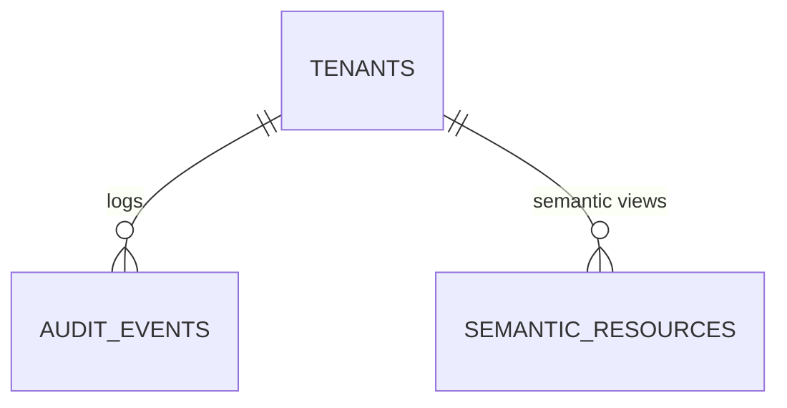

# Database Schema (MVP)

This document describes the **relational database schema** for the Interoperable
Data Hub MVP. It is derived from the Domain Model and Technical Design
Document, and focuses on:

- Core entities and their relationships (ER view).
- Table definitions (columns, primary/foreign keys, constraints).
- Index strategy.
- Multi-tenancy implementation using `tenant_id`.

Assumptions:

- **PostgreSQL** (or compatible) is used as the primary relational store.
- UUIDs are used as primary keys for core entities.
- `JSONB` is used for flexible structures (e.g. HubContract JSON, DQ/compliance
  results, semantic metadata).

---

## 1. Multi-Tenancy Strategy

### 1.1 Row-Level Multi-Tenancy

- All **business tables** are **row-level multi-tenant**:
  - Each row belongs to exactly one tenant, indicated by `tenant_id`.
  - Exceptions:
    - `tenants` (root table listing tenants).
    - Certain semantic or marketplace tables where `tenant_id` may be nullable
      for global entries (e.g. shared semantic classes).
- There is **no row sharing** between tenants:
  - A tenant never sees rows owned by another tenant, except where explicitly
    modeled via **marketplace entitlements**.

### 1.2 `tenant_id` Placement

- Tables that are **owned by a single tenant** include `tenant_id` as a column
  and it is part of most lookup indexes, for example:
  - `users`, `roles`, `assets`, `datasets`, `files`,
  - `contracts`, `dq_runs`, `compliance_runs`, `jobs`, `audit_events`,
  - `listings`, `orders`, `entitlements`,
  - `semantic_resources` (for tenant-specific resources).

- Marketplace tables distinguish:
  - **Provider** tenant (on `listings`: `tenant_id` as provider).
  - **Consumer** tenant (on `orders`, `entitlements`: `tenant_id` as consumer).

### 1.3 Tenant-Scoped Indexing

- Most **secondary indexes** use `tenant_id` as the **leading column**, e.g.:
  - `(tenant_id, key)` on `assets`.
  - `(tenant_id, asset_id, version)` on `datasets`.
  - `(tenant_id, status)` on `dq_runs`, `compliance_runs`.
  - `(tenant_id, timestamp)` on `audit_events`.

This keeps per-tenant queries efficient and simplifies sharding / partitioning
strategies in future.

---

## 2. Entity–Relationship Overview

### 2.1 Identity & Tenancy



- A `TENANT` has many `USERS`.
- `ROLES` are defined per `TENANT` (`TENANT_ADMIN`, `PROVIDER`, etc.).
- `USER_ROLES` provides the many-to-many join between `USERS` and `ROLES`.

### 2.2 Catalog: Assets, Datasets, Contracts, Files



- An `ASSET` is a logical data product, owned by a tenant.
- A `DATASET` represents a concrete version/realization of an asset.
- A `CONTRACT` represents a versioned HubContract attached to an asset.
- A `FILE` is an uploaded object used for datasets or scan-only operations.

### 2.3 Quality, Compliance, Jobs



- `DQ_RUNS` and `COMPLIANCE_RUNS` are associated with assets/datasets/files and
  are tracked by `JOBS`.

### 2.4 Marketplace & Entitlements



- Providers expose assets via `LISTINGS`.
- Consumers create `ORDERS`; approved orders yield `ENTITLEMENTS`.

### 2.5 Audit & Semantic Mapping



- `AUDIT_EVENTS` track security/governance-relevant actions.
- `SEMANTIC_RESOURCES` link relational entities to RDF resources in the triple
  store.

These diagrams are conceptual; see the table definitions below for exact keys
and foreign-key relationships.

---

## 3. Table Definitions

### 3.1 Identity & Tenancy

#### 3.1.1 `tenants`

Represents organizations (or individual users acting as their own tenant).

**Columns**

- `id` UUID, **PK**, **NOT NULL**
- `name` text, **NOT NULL**, unique within environment
- `slug` text, **NOT NULL**, URL-safe, unique
- `status` enum: `ACTIVE`, `SUSPENDED`, `DELETED`, **NOT NULL**, **DEFAULT `ACTIVE`**
  - **Status meanings**:
    - `ACTIVE`: Tenant is fully operational (all operations allowed).
    - `SUSPENDED`: Tenant is temporarily suspended (read-only access allowed, write operations blocked). Can be reactivated.
    - `DELETED`: Tenant is marked for deletion (all access blocked, data retention period active). Cannot be reactivated.
  - **Suspended tenant behavior**: See `Domain_Model.md` §1.1 for detailed behavior rules.
  - **Suspension vs deletion**: See `SystemRequrements.md` §18.1.2 for differences and suspension → deletion flow.
- `kyc_status` enum: `UNVERIFIED`, `VERIFIED`, **NOT NULL**, **DEFAULT `UNVERIFIED`**
  - **KYC Status meanings**:
    - `UNVERIFIED`: Tenant has not completed KYC verification. Cannot publish assets to marketplace.
    - `VERIFIED`: Tenant has completed KYC verification. Can publish assets to marketplace.
  - **KYC Status impact**: Only tenants with `kyc_status = VERIFIED` are allowed to publish public/marketplace assets. See `Domain_Model.md` §1.1 and `API_Spec_v1.md` §12.4 for details.
- `region` text, **NULL** (e.g. cloud region)
- `deleted_at` timestamp (UTC), **NULL**, **DEFAULT NULL**
  - **Deletion timestamp**: Set when tenant is marked for deletion (`status = DELETED`). Used for retention period tracking (default: 30 days before physical deletion).
  - **See**: §7 (Tenant Deletion Cascade Rules) for deletion process details.
- `created_at` timestamp (UTC), **NOT NULL**, **DEFAULT CURRENT_TIMESTAMP**
- `updated_at` timestamp (UTC), **NOT NULL**, **DEFAULT CURRENT_TIMESTAMP**

**Indexes & Constraints**

- Unique index on `slug`.
- Unique index on `name` (per environment).
- Index on `kyc_status` for filtering verified tenants (e.g., marketplace listings).
- Optional index on `region` for residency queries.

#### 3.1.2 `users`

Represents user accounts; always associated with exactly one tenant in MVP.

**Columns**

- `id` UUID, **PK**, **NOT NULL**
- `tenant_id` UUID, FK → `tenants.id`, **NOT NULL**
- `email` text, **NOT NULL** (unique per tenant)
- `password` text, **NULL**, **DEFAULT NULL**
  - **Password hash**: Django stores hashed passwords here using PBKDF2/Argon2 (see `Technology_Stack_Decisions.md` §8.2).
  - **NULL** when `status = INVITED` (password not set yet).
  - **NOT NULL** when `status = ACTIVE` (password must be set via invitation acceptance or password reset).
  - **Storage**: Django's `User` model uses `password` field name by default. The hash format is: `algorithm$iterations$salt$hash` (e.g., `pbkdf2_sha256$600000$salt$hash`).
- `display_name` text, **NULL**
- `status` enum: `ACTIVE`, `INVITED`, `DISABLED`, **NOT NULL**, **DEFAULT `INVITED`**
- `is_platform_admin` boolean, **NOT NULL**, **DEFAULT `false`**
  - **Platform Admin flag**: When `true`, user has platform-level admin privileges (can manage tenants, access cross-tenant data).
  - **Note**: Platform Admin is not tenant-scoped; `is_platform_admin = true` users can operate across all tenants.
  - **See**: §3.1.3 for Platform Admin role details.
- `invitation_token` UUID, **NULL**, **DEFAULT NULL**
  - **Invitation token**: UUID v4 token for user invitation acceptance. Generated when user is created with `status = INVITED`. Cleared after acceptance.
  - **Format**: UUID v4 (36 characters, e.g., `550e8400-e29b-41d4-a716-446655440000`)
  - **See**: `Security_Design_and_Threat_Model.md` §5.11.7 for format and lifecycle details.
- `invitation_token_expires_at` timestamp (UTC), **NULL**, **DEFAULT NULL**
  - **Expiration**: Token expiration time (default: 7 days from creation, configurable via `INVITATION_TOKEN_TTL_DAYS`).
- `invitation_token_used_at` timestamp (UTC), **NULL**, **DEFAULT NULL**
  - **Usage timestamp**: When token was used (set to `NOW()` after successful invitation acceptance). `NULL` until used.
- `password_reset_token` UUID, **NULL**, **DEFAULT NULL**
  - **Password reset token**: UUID v4 token for password reset. Generated when password reset is requested. Cleared after reset completion.
  - **Format**: UUID v4 (36 characters, e.g., `550e8400-e29b-41d4-a716-446655440000`)
  - **See**: `Security_Design_and_Threat_Model.md` §5.11.8 for format and lifecycle details.
- `password_reset_token_expires_at` timestamp (UTC), **NULL**, **DEFAULT NULL**
  - **Expiration**: Token expiration time (default: 1 hour from creation, configurable via `PASSWORD_RESET_TOKEN_TTL_SECONDS`).
- `password_reset_token_used_at` timestamp (UTC), **NULL**, **DEFAULT NULL**
  - **Usage timestamp**: When token was used (set to `NOW()` after successful password reset). `NULL` until used.
- `token_version` integer, **NOT NULL**, **DEFAULT 1**
  - **Token version**: Incremented when user's password is reset or roles change. Used to invalidate existing JWT tokens.
  - **See**: `Security_Design_and_Threat_Model.md` §5.11.5 for token revocation details.
- `created_at` timestamp, **NOT NULL**, **DEFAULT CURRENT_TIMESTAMP**
- `updated_at` timestamp, **NOT NULL**, **DEFAULT CURRENT_TIMESTAMP**

**Indexes & Constraints**

- Unique index on `(tenant_id, email)`.
- Foreign key (`tenant_id`) with `ON DELETE RESTRICT` to prevent orphaned users.

#### 3.1.3 Platform Admin Role

**Platform Admin** is a special role that operates **across all tenants** and is not tenant-scoped. Platform Admins can:

- Create, update, suspend, and delete tenants
- Manage tenant KYC status
- Access cross-tenant audit logs and metrics
- Manage platform-level configuration

**Platform Admin Storage & Authentication**

For MVP, Platform Admin is implemented as:

- **Storage**: A boolean flag `is_platform_admin` on the `users` table (see §3.1.2)
  - **Alternative (future)**: A separate `platform_admins` table or a special `PLATFORM_ADMIN` role in a global `roles` table
- **Authentication**: Platform Admins authenticate using the same JWT/API key mechanism as regular users
  - JWT tokens for Platform Admins include a special claim: `platform_admin: true`
  - API keys for Platform Admins have a special scope: `platform:admin`
- **Authorization**: Platform Admin checks are performed at the API layer (middleware/views)
  - Endpoints requiring Platform Admin check for `user.is_platform_admin = true` or `token.platform_admin = true`
  - Platform Admin operations are **not tenant-scoped** (no `tenant_id` filtering)

**Note**: Platform Admin is **not** stored in the tenant-scoped `roles` table. It is a platform-level privilege that transcends tenant boundaries.

**Reference**: See `API_Spec_v1.md` §12 (Tenant Management API) for Platform Admin-only endpoints.

---

#### 3.1.4 `roles` and `user_roles`

`roles` – logical permissions within a tenant.

**`roles` Columns**

- `id` UUID, **PK**, **NOT NULL**
- `tenant_id` UUID, FK → `tenants.id`, **NOT NULL**
- `name` text, **NOT NULL** (e.g. `TENANT_ADMIN`, `PROVIDER`, `CONSUMER`, `AUDITOR`)
- `description` text, **NULL**
- `created_at` timestamp, **NOT NULL**, **DEFAULT CURRENT_TIMESTAMP**
- `updated_at` timestamp, **NOT NULL**, **DEFAULT CURRENT_TIMESTAMP**

**Indexes & Constraints**

- Unique index on `(tenant_id, name)`.

**Default Roles Creation**

When a new tenant is created (`POST /tenants`), the following default roles are **automatically created** in the `roles` table:

- `TENANT_ADMIN` – Full administrative access within the tenant
- `DATA_PROVIDER` – Can create and manage data assets
- `DATA_CONSUMER` – Can request and access data assets
- `AUDITOR` – Read-only access to compliance/DQ reports and audit logs

**Implementation Notes**:

- Default roles are created **atomically** in a single transaction after tenant creation (see `Architecture_API_Alignment.md` §5.7.2.1 "Tenant Creation with Initial Admin").
- Role creation uses `INSERT ... ON CONFLICT DO NOTHING` for idempotency (roles are not re-created if they already exist).
- Role names are **case-sensitive** and must match exactly: `TENANT_ADMIN`, `DATA_PROVIDER`, `DATA_CONSUMER`, `AUDITOR`.
- Custom roles can be created later by tenant admins, but the default roles are always available.

`user_roles` – many-to-many join between users and roles.

**`user_roles` Columns**

- `user_id` UUID, FK → `users.id`, **NOT NULL**
- `role_id` UUID, FK → `roles.id`, **NOT NULL**

**Constraints & Indexes**

- Composite primary key `(user_id, role_id)`.
- Foreign keys with `ON DELETE CASCADE` to remove role memberships when a user
  or role is deleted.

---

#### 3.1.5 `refresh_tokens`

Stores refresh tokens for JWT token rotation and session management.

**Columns**

- `id` UUID, **PK**, **NOT NULL** (refresh token ID / `jti`)
- `user_id` UUID, FK → `users.id`, **NOT NULL**
- `tenant_id` UUID, FK → `tenants.id`, **NOT NULL**
- `token_hash` text, **NOT NULL`
  - **Token hash**: Hash of the refresh token (bcrypt/argon2). Used for validation during refresh.
  - **Format**: Opaque token (random string or JWT with `jti`) is hashed before storage.
  - **Never store plaintext**: Only the hash is persisted.
- `issued_at` timestamp (UTC), **NOT NULL**, **DEFAULT CURRENT_TIMESTAMP**
- `expires_at` timestamp (UTC), **NOT NULL**
  - **Expiration**: Default 14 days from `issued_at` (configurable via `REFRESH_TOKEN_TTL_SECONDS`).
- `revoked_at` timestamp (UTC), **NULL**, **DEFAULT NULL**
  - **Revocation timestamp**: Set when token is revoked (logout, rotation, security incident). `NULL` if not revoked.
- `revoked_reason` text, **NULL**, **DEFAULT NULL**
  - **Revocation reason**: Reason for revocation (e.g., `LOGOUT`, `ROTATED`, `PASSWORD_RESET`, `SECURITY_INCIDENT`).
- `client_id` text, **NULL**, **DEFAULT NULL`
  - **Client identifier**: Optional device/browser identifier for per-device session management.
- `created_at` timestamp (UTC), **NOT NULL**, **DEFAULT CURRENT_TIMESTAMP**
 
**Indexes & Constraints**

- Index on `(user_id, revoked_at)` for active token lookups.
- Index on `(tenant_id, expires_at)` for expiration cleanup.
- Index on `(user_id, expires_at)` where `revoked_at IS NULL` for validation queries.
- Foreign key (`user_id`) with `ON DELETE CASCADE` to remove tokens when user is deleted.

**Token Lifecycle**

- **Creation**: When user logs in or accepts invitation, a new refresh token is created.
- **Validation**: During token refresh, system checks `expires_at > NOW()` and `revoked_at IS NULL`.
- **Rotation**: On successful refresh, old token is marked `revoked_at = NOW()`, `revoked_reason = 'ROTATED'`, and a new token is created.
- **Revocation**: Tokens can be revoked via logout, password reset, or admin action.

**See**: `Security_Design_and_Threat_Model.md` §5.11.3 and §5.11.4 for refresh token details.

---

#### 3.1.6 `api_keys`

Stores API keys for programmatic access (server-to-server, CI/CD, service accounts).

**Columns**

- `id` UUID, **PK**, **NOT NULL**
- `tenant_id` UUID, FK → `tenants.id`, **NOT NULL**
- `user_id` UUID, FK → `users.id`, **NOT NULL** (user who created the API key)
- `name` text, **NOT NULL`
  - **User-provided label**: Descriptive name for the API key (e.g., "Production CI/CD Key").
- `key_hash` text, **NOT NULL`
  - **Key hash**: bcrypt/argon2 hash of the full API key (prefix + secret).
  - **Never store plaintext**: Only the hash is persisted.
  - **Format**: Django's password hashing (same as user passwords).
- `prefix` text, **NOT NULL`
  - **Key prefix**: `idh_live_` (production) or `idh_test_` (non-production).
  - **Used for lookup**: Combined with hash for validation.
- `scopes` JSONB, **NOT NULL**
  - **Permissions**: Array of scope strings (e.g., `["assets:read", "assets:write", "jobs:read"]`).
  - **Format**: JSON array of strings.
- `created_by_user_id` UUID, FK → `users.id`, **NOT NULL`
  - **Creator**: User who created the API key (may differ from `user_id` if created by admin).
- `created_at` timestamp (UTC), **NOT NULL**, **DEFAULT CURRENT_TIMESTAMP**
- `last_used_at` timestamp (UTC), **NULL**, **DEFAULT NULL`
  - **Last usage**: Updated on each API key authentication. `NULL` if never used.
- `expires_at` timestamp (UTC), **NULL**, **DEFAULT NULL`
  - **Expiration**: Optional expiration date. `NULL` means no expiration.
- `revoked_at` timestamp (UTC), **NULL**, **DEFAULT NULL`
  - **Revocation timestamp**: Set when key is revoked. `NULL` if not revoked.
- `revoked_reason` text, **NULL**, **DEFAULT NULL`
  - **Revocation reason**: Reason for revocation (e.g., `USER_REVOKED`, `SECURITY_INCIDENT`, `EXPIRED`).

**Indexes & Constraints**

- Index on `(tenant_id, revoked_at)` for active key lookups.
- Index on `(user_id, revoked_at)` for user's active keys.
- Index on `(prefix, key_hash)` for key validation (partial index where `revoked_at IS NULL`).
- Foreign key (`tenant_id`) with `ON DELETE CASCADE` to remove keys when tenant is deleted.
- Foreign key (`user_id`) with `ON DELETE CASCADE` to remove keys when user is deleted.

**API Key Validation**

- **Lookup**: Extract prefix from API key, query `api_keys` where `prefix = <extracted>` and `revoked_at IS NULL`.
- **Verification**: Hash the provided key and compare with `key_hash` using Django's password verification.
- **Scope check**: Verify requested operation's scope is in `scopes` array.
- **Expiration check**: Verify `expires_at IS NULL OR expires_at > NOW()`.

**See**: `Security_Design_and_Threat_Model.md` §5.11.9 for API key format and usage details.

---

### 3.2 Catalog: Assets, Datasets, Files, Contracts

#### 3.2.1 `assets`

Represents a single logical data product (contract + dataset).

**Columns**

- `id` UUID, **PK**, **NOT NULL**
- `tenant_id` UUID, FK, **NOT NULL**
- `key` text, **NOT NULL** – unique per tenant; human-friendly identifier.
- `name` text, **NOT NULL**
- `description` text, **NULL**
- `domain` text, **NULL** (e.g. `marketing`, `finance`)
- `status` enum: `DRAFT`, `ACTIVE`, `RETIRED`, **NOT NULL**, **DEFAULT `DRAFT``
  - **Note**: `status` is the **lifecycle state** (user-controlled). See `validation_status` for CLI validation results.
- `visibility` enum: `INTERNAL`, `PUBLIC`, **NOT NULL**, **DEFAULT `INTERNAL`**
- `dq_status` enum: `UNKNOWN`, `PASS`, `WARN`, `FAIL`, **NOT NULL**, **DEFAULT `UNKNOWN`**
- `compliance_status` enum: `UNKNOWN`, `PASS`, `WARN`, `FAIL`, **NOT NULL**, **DEFAULT `UNKNOWN`**
- `created_by` UUID, FK → `users.id`, **NOT NULL**
- `version` integer, **NOT NULL**, **DEFAULT 1** – optimistic locking version counter
- `created_at` timestamp, **NOT NULL**, **DEFAULT CURRENT_TIMESTAMP**
- `updated_at` timestamp, **NOT NULL**, **DEFAULT CURRENT_TIMESTAMP**

**Indexes & Constraints**

- Unique index on `(tenant_id, key)`.
- Index on `(tenant_id, visibility)`.
- Index on `(tenant_id, dq_status)`.
- Index on `(tenant_id, compliance_status)`.

**Optimistic Locking**

- The `version` field is used for optimistic concurrency control to prevent lost updates.
- On every `UPDATE`, the `version` field is incremented automatically (via application logic or database trigger).
- Clients MUST include the current `version` value in `PATCH` requests (see `API_Spec_v1.md` §4.4).
- If the `version` in the request does not match the current database value, the update is rejected with `409 Conflict` and error code `ASSET_CONCURRENT_MODIFICATION`.
- The `version` field is also included in `GET /assets/{id}` responses so clients can track the current version.

#### 3.2.2 `datasets`

Represents a dataset attached to an asset (file-based or external reference).

**Columns**

- `id` UUID, **PK**, **NOT NULL**
- `tenant_id` UUID, FK, **NOT NULL**
- `asset_id` UUID, FK → `assets.id`, **NOT NULL**
- `version` integer, **NOT NULL** – per-asset dataset version counter
- `kind` enum: `FILE`, `EXTERNAL_REF`, **NOT NULL**
- `file_id` UUID, FK → `files.id`, **NULL** (required when `kind = 'FILE'`)
- `external_ref` text, **NULL** (required when `kind = 'EXTERNAL_REF'`, e.g. table name, connection identifier)
- `schema_inferred` JSONB, **NULL** – schema inferred from data
- `row_count` bigint, **NULL**
- `sample_reference` JSONB or text, **NULL** – pointer to stored sample
- `created_by` UUID, **NOT NULL**
- `created_at` timestamp, **NOT NULL**, **DEFAULT CURRENT_TIMESTAMP**
- `updated_at` timestamp, **NOT NULL**, **DEFAULT CURRENT_TIMESTAMP**

**Indexes & Constraints**

- Unique index on `(tenant_id, asset_id, version)`.
- Index on `(tenant_id, asset_id)` for “latest dataset” queries.

#### 3.2.3 `files`

Represents uploaded files (intake or scan-only).

**Columns**

- `id` UUID, **PK**, **NOT NULL**
- `tenant_id` UUID, FK, **NOT NULL**
- `original_filename` text, **NOT NULL**
- `content_type` text, **NULL**
- `size_bytes` bigint, **NULL** (set when upload completes)
- `storage_path` text, **NOT NULL** (bucket/key)
- `purpose` enum: `DATASET`, `EXTERNAL_SCAN`, `SAMPLE`, `REPORT`, **NOT NULL**
- `status` enum: `UPLOADING`, `READY`, `FAILED`, `DELETED`, **NOT NULL**, **DEFAULT `UPLOADING`**
- `content_sha256` text, **NULL**, **DEFAULT NULL** (SHA-256 hash of file content, hex-encoded)
  - `NULL` during upload (`status = UPLOADING`)
  - Computed and set to **NOT NULL** when upload completes (`status = READY`)
  - Indexed for deduplication lookups
- `created_by` UUID, **NULL** (nullable for system-created files)
- `created_at` timestamp, **NOT NULL**, **DEFAULT CURRENT_TIMESTAMP**
- `updated_at` timestamp, **NOT NULL**, **DEFAULT CURRENT_TIMESTAMP**

**Indexes & Constraints**

- Index on `(tenant_id, status)`.
- Index on `(tenant_id, content_sha256)` for deduplication lookups (where `content_sha256 IS NOT NULL`).
- Unique index on `storage_path`.

#### 3.2.4 `contracts`

Represents the canonical internal HubContract plus the original source
contract.

**Columns**

- `id` UUID, **PK**, **NOT NULL**
- `tenant_id` UUID, FK, **NOT NULL**
- `asset_id` UUID, FK → `assets.id`, **NULL** (nullable for contract-only assets)
- `version` integer, **NOT NULL** – per-asset contract version counter
- `source_spec` text, **NOT NULL** (e.g. `ODCS`, `DATA_CONTRACT_DOT_COM`)
- `source_spec_version` text, **NOT NULL** (e.g. `3.0.2`)
- `hub_contract_version` text, **NOT NULL** (e.g. `1.0.0`)
- `original_raw` JSONB or text, **NOT NULL** – verbatim source contract
- `hub_contract_json` JSONB, **NULL** – normalized HubContract (set after normalization)
- `validation_status` enum: `VALID`, `INVALID`, `WARNING_ONLY`, `ERROR`, **NULL**, **DEFAULT NULL** (result from DataContract CLI, NULL before validation)
- `normalization_status` enum, **NULL**, **DEFAULT NULL** (normalization result, NULL before normalization)
- `created_by` UUID, **NOT NULL**
- `created_at` timestamp, **NOT NULL**, **DEFAULT CURRENT_TIMESTAMP**
- `updated_at` timestamp, **NOT NULL**, **DEFAULT CURRENT_TIMESTAMP**
- `status` enum: `DRAFT`, `ACTIVE`, `RETIRED`, **NOT NULL**, **DEFAULT `DRAFT`**
  - **Note**: `status` is the **lifecycle state** (user-controlled), separate from `validation_status` (CLI validation result).
  - `DRAFT` → Contract is being created/edited, not yet active (default)
  - `ACTIVE` → Contract is validated and in use (requires `validation_status = VALID` or `WARNING_ONLY` per tenant policy)
  - `RETIRED` → Contract is no longer in use but retained for audit/history
  - **Relationship with `validation_status`**:
    - A contract can have `status = DRAFT` and `validation_status = VALID` (validated but not yet activated)
    - A contract can have `status = ACTIVE` only if `validation_status = VALID` or `WARNING_ONLY` (per tenant policy)
    - `status = ACTIVE` also requires `normalization_status in { NORMALIZED_OK, NORMALIZED_WITH_WARNINGS }`

**Contract Version Tracking**

- **`version` field**: Tracks per-asset contract versions (increments when a new contract is created for the same asset)
- **`hub_contract_version` field**: Tracks the HubContract schema version (e.g., `1.0.0`, `2.0.0`)
- **Contract history**: Previous contract states are **not automatically preserved** in the database:
  - `PATCH /contracts/{id}` updates the contract in place (same `version` number)
  - Contract changes are logged in `audit_events` with old and new `hub_contract_json` in `details_json`
  - To preserve version history, create new contract records via `POST /contracts` instead of updating in place
- **Accessing previous versions**:
  - **Via audit logs**: Query `audit_events` with `event_type = CONTRACT_UPDATED` to see contract change history
  - **Via contract migration**: `POST /contracts/{id}/migrate` can create a new contract version if needed
  - **Future enhancement**: Contract version history table may be added for easier access to previous versions

**Indexes & Constraints**

- Unique index on `(tenant_id, asset_id, version)`.
- Index on `(tenant_id, status)` if a logical `status` field is used.
- Optional GIN indexes on key JSONB fields if needed for search (future).

---

### 3.3 Quality & Compliance

#### 3.3.1 `dq_runs`

Represents one data quality run invocation.

**Columns**

- `id` UUID, **PK**, **NOT NULL**
- `tenant_id` UUID, FK, **NOT NULL**
- `asset_id` UUID, FK → `assets.id`, **NULL** (at least one of `asset_id`, `dataset_id`, or `file_id` must be non-NULL)
- `dataset_id` UUID, FK → `datasets.id`, **NULL** (at least one of `asset_id`, `dataset_id`, or `file_id` must be non-NULL)
- `file_id` UUID, FK → `files.id`, **NULL** (scan-only; at least one of `asset_id`, `dataset_id`, or `file_id` must be non-NULL)
- `job_id` UUID, FK → `jobs.id`, **NOT NULL**
- `profile` text, **NOT NULL** (e.g. `intake_basic`, `custom_profile`)
- `engine` text, **NOT NULL**: `GREAT_EXPECTATIONS`, `SODA`
- `status` enum: `PENDING`, `RUNNING`, `SUCCEEDED`, `FAILED`, **NOT NULL**, **DEFAULT `PENDING`**
- `result_summary` JSONB, **NULL** (metrics, scores, counts; populated when status = SUCCEEDED)
- `issues` JSONB, **NULL** (list of failed checks, severity; populated when status = FAILED or when warnings exist)
- `created_at` timestamp, **NOT NULL**, **DEFAULT CURRENT_TIMESTAMP**
- `updated_at` timestamp, **NOT NULL**, **DEFAULT CURRENT_TIMESTAMP**

**Indexes & Constraints**

- Index on `(tenant_id, asset_id)`.
- Index on `(tenant_id, dataset_id)`.
- Index on `(tenant_id, status)`.

#### 3.3.2 `compliance_runs`

Represents a compliance check invocation.

**Columns**

- `id` UUID, **PK**, **NOT NULL**
- `tenant_id` UUID, FK, **NOT NULL**
- `asset_id` UUID, FK, **NULL** (at least one of `asset_id`, `dataset_id`, or `file_id` must be non-NULL)
- `dataset_id` UUID, FK, **NULL** (at least one of `asset_id`, `dataset_id`, or `file_id` must be non-NULL)
- `file_id` UUID, FK, **NULL** (scan-only; at least one of `asset_id`, `dataset_id`, or `file_id` must be non-NULL)
- `job_id` UUID, FK → `jobs.id`, **NOT NULL**
- `regulations` text[], **NULL** (e.g. `["GDPR","LGPD"]`; populated when status = SUCCEEDED)
- `status` enum: `PENDING`, `RUNNING`, `SUCCEEDED`, `FAILED`, **NOT NULL**, **DEFAULT `PENDING`**
- `allowed_to_store` boolean, **NULL**, **DEFAULT NULL** (set when status = SUCCEEDED; NULL indicates check not completed)
- `pii_summary` JSONB, **NULL** (categories and counts; populated when status = SUCCEEDED)
- `details_json` JSONB, **NULL** (per-field/per-rule details; populated when status = SUCCEEDED or FAILED)
- `created_at` timestamp, **NOT NULL**, **DEFAULT CURRENT_TIMESTAMP**
- `updated_at` timestamp, **NOT NULL**, **DEFAULT CURRENT_TIMESTAMP**

**Indexes & Constraints**

- Index on `(tenant_id, asset_id)`.
- Index on `(tenant_id, dataset_id)`.
- Index on `(tenant_id, status)`.

---

### 3.4 Jobs & Audit

#### 3.4.1 `jobs`

Represents long-running operations (see Jobs model).

**Columns**

- `id` UUID, **PK**, **NOT NULL**
- `tenant_id` UUID, FK, **NULL** (nullable for global/system jobs)
- `user_id` UUID, FK → `users.id`, **NULL**
- `type` enum: `QUALITY_CHECK`, `COMPLIANCE_CHECK`, `CONTRACT_VALIDATION`,
  `SEMANTIC_MAPPING`, `CONTRACT_MIGRATION`, etc., **NOT NULL**
- `status` enum: `PENDING`, `RUNNING`, `SUCCEEDED`, `FAILED`, `CANCELLED`, **NOT NULL**, **DEFAULT `PENDING`**
- `resource_type` text, **NOT NULL**: `CONTRACT`, `DATASET`, `FILE`, `ASSET`, etc.
- `resource_id` UUID, **NOT NULL**
- `created_at` timestamp, **NOT NULL**, **DEFAULT CURRENT_TIMESTAMP**
- `started_at` timestamp, **NULL** (set when status transitions to RUNNING)
- `finished_at` timestamp, **NULL** (set when status transitions to terminal state)
- `details_json` JSONB, **NULL**, **DEFAULT NULL** (engine versions, progress, error codes; may be NULL for jobs that haven't started or don't produce details)

**Indexes & Constraints**

- Index on `(tenant_id, status)`.
- Index on `(tenant_id, resource_type, resource_id)`.

#### 3.4.2 `audit_events`

Append-only log of governance-relevant events.

**Columns**

- `id` UUID, **PK**, **NOT NULL**
- `tenant_id` UUID, FK, **NOT NULL**
- `user_id` UUID, FK, **NULL**
- `event_type` enum, **NOT NULL**:
    'QUALITY_CHECK_STARTED',
    'QUALITY_CHECK_COMPLETED',
    'QUALITY_CHECK_FAILED',
    'COMPLIANCE_CHECK_STARTED',
    'COMPLIANCE_CHECK_COMPLETED',
    'COMPLIANCE_CHECK_FAILED',
    'CONTRACT_VALIDATION_STARTED',
    'CONTRACT_VALIDATION_COMPLETED',
    'CONTRACT_VALIDATION_FAILED',
    'ASSET_PUBLISHED',
    'TENANT_CREATED',
    'TENANT_UPDATED',
    'TENANT_SUSPENDED',
    'TENANT_REACTIVATED',
    'TENANT_DELETED',
    'USER_CREATED',
    'USER_UPDATED',
    'USER_INVITED',
    'USER_INVITATION_ACCEPTED',
    'USER_ACTIVATED',
    'USER_DISABLED',
    'USER_DELETED',
    'USER_LOGIN',
    'USER_LOGOUT',
    'PASSWORD_RESET_REQUESTED',
    'PASSWORD_RESET_COMPLETED',
    'API_KEY_CREATED',
    'API_KEY_REVOKED',
    'TOKEN_REVOKED',
    etc.
- `entity_type` text, **NOT NULL**: `ASSET`, `CONTRACT`, `DATASET`, `JOB`, `LISTING`, etc.
- `entity_id` UUID, **NULL**
- `timestamp` timestamp (UTC), **NOT NULL**, **DEFAULT CURRENT_TIMESTAMP**
- `metadata` JSONB, **NULL** (summarized details, no raw PII)
- `request_id` text, **NULL**

**Indexes & Constraints**

- Index on `(tenant_id, timestamp)`.
- Index on `(tenant_id, entity_type, entity_id)`.
- Index on `(tenant_id, event_type, timestamp)`.

---

### 3.5 Marketplace

#### 3.5.1 `listings`

Public or internal offers exposed in the marketplace.

**Columns**

- `id` UUID, **PK**, **NOT NULL**
- `tenant_id` UUID (provider), **NOT NULL**
- `asset_id` UUID, FK → `assets.id`, **NOT NULL**
- `status` enum: `DRAFT`, `PUBLISHED`, `UNPUBLISHED`, **NOT NULL**, **DEFAULT `DRAFT`**
- `pricing_model` text, **NOT NULL** (e.g. `FREE`, `FREE_AUTO_APPROVE`, `REQUEST_APPROVAL`)
- `metadata` JSONB, **NULL** (description, legal terms)
- `created_at` timestamp, **NOT NULL**, **DEFAULT CURRENT_TIMESTAMP**
- `updated_at` timestamp, **NOT NULL**, **DEFAULT CURRENT_TIMESTAMP**

**Indexes & Constraints**

- Index on `(tenant_id, asset_id)`.
- Index on `(status)`.

#### 3.5.2 `orders`

Orders created for `REQUEST_APPROVAL` flows.

**Columns**

- `id` UUID, **PK**, **NOT NULL**
- `tenant_id` UUID (consumer), **NOT NULL**
- `listing_id` UUID, FK → `listings.id`, **NOT NULL**
- `status` enum: `REQUESTED`, `APPROVED`, `REJECTED`, `CANCELLED`, **NOT NULL**, **DEFAULT `REQUESTED`**
- `created_by` UUID, FK → `users.id`, **NOT NULL**
- `created_at` timestamp, **NOT NULL**, **DEFAULT CURRENT_TIMESTAMP**
- `updated_at` timestamp, **NOT NULL**, **DEFAULT CURRENT_TIMESTAMP**

**Indexes & Constraints**

- Index on `(tenant_id, listing_id)`.
- Index on `(status)`.

#### 3.5.3 `entitlements`

Who can access which asset.

**Columns**

- `id` UUID, **PK**, **NOT NULL**
- `tenant_id` UUID (consumer), **NOT NULL**
- `listing_id` UUID, FK → `listings.id`, **NOT NULL**
- `asset_id` UUID, FK → `assets.id`, **NOT NULL**
- `status` enum: `ACTIVE`, `REVOKED`, `EXPIRED`, **NOT NULL**, **DEFAULT `ACTIVE`**
- `granted_at` timestamp, **NOT NULL**, **DEFAULT CURRENT_TIMESTAMP**
- `revoked_at` timestamp, **NULL** (set when status = REVOKED)
- `expires_at` timestamp, **NULL** (set when entitlement has expiration)
- `metadata` JSONB, **NULL** (license details, expiry)

**Indexes & Constraints**

- Index on `(tenant_id, asset_id, status)`.
- Index on `(listing_id, status)`.

---

### 3.6 Semantic Mapping

#### 3.6.1 `semantic_resources`

Relational reference to resources stored in the triple store.

**Columns**

- `id` UUID, **PK**, **NOT NULL**
- `tenant_id` UUID, FK, **NULL** (nullable for global classes)
- `resource_type` text, **NOT NULL**: `ASSET`, `CONTRACT`, `DATASET`, `FIELD`, `LISTING`, etc.
- `resource_id` UUID, **NOT NULL**
- `uri` text, **NOT NULL**, unique
- `status` enum: `ACTIVE`, `DEGRADED`, `STALE`, **NOT NULL**, **DEFAULT `ACTIVE`**
- `last_mapped_at` timestamp, **NOT NULL**, **DEFAULT CURRENT_TIMESTAMP**
- `mapping_version` text, **NOT NULL** (semantic mapping version)
- `metadata` JSONB, **NULL** (additional links)

**Indexes & Constraints**

- Unique index on `uri`.
- Unique index on `(tenant_id, resource_type, resource_id)`.

---

## 4. Index Strategy Summary

### 4.1 Tenant-Scoped Indexes

- Most queries are scoped by `tenant_id`, so composite indexes start with
  `tenant_id`:
  - Example patterns:
    - `(tenant_id, key)` on `assets`.
    - `(tenant_id, asset_id, version)` on `datasets` and `contracts`.
    - `(tenant_id, status)` on `dq_runs`, `compliance_runs`, `jobs`.
    - `(tenant_id, timestamp)` on `audit_events`.

### 4.2 Lookup & Uniqueness

- Stable public identifiers (e.g. `assets.key`, `tenants.slug`) get unique
  indexes.
- Many-to-many tables use composite primary keys (e.g. `(user_id, role_id)`).
- Semantic references use unique URIs in `semantic_resources`.

### 4.3 Explicit Index Definitions

The following CREATE INDEX statements define all indexes required for the MVP schema:

**Tenants Table**
```sql
CREATE UNIQUE INDEX idx_tenants_slug ON tenants(slug);
CREATE UNIQUE INDEX idx_tenants_name ON tenants(name);
CREATE INDEX idx_tenants_kyc_status ON tenants(kyc_status);
CREATE INDEX idx_tenants_region ON tenants(region);
```

**Users Table**
```sql
CREATE UNIQUE INDEX idx_users_tenant_email ON users(tenant_id, email);
CREATE INDEX idx_users_tenant_status ON users(tenant_id, status);
CREATE INDEX idx_users_platform_admin ON users(is_platform_admin) WHERE is_platform_admin = true;
```

**Roles Table**
```sql
CREATE UNIQUE INDEX idx_roles_tenant_name ON roles(tenant_id, name);
```

**Refresh Tokens Table**
```sql
CREATE INDEX idx_refresh_tokens_user_revoked ON refresh_tokens(user_id, revoked_at);
CREATE INDEX idx_refresh_tokens_tenant_expires ON refresh_tokens(tenant_id, expires_at);
CREATE INDEX idx_refresh_tokens_user_expires ON refresh_tokens(user_id, expires_at) WHERE revoked_at IS NULL;
```

**API Keys Table**
```sql
CREATE INDEX idx_api_keys_tenant_revoked ON api_keys(tenant_id, revoked_at);
CREATE INDEX idx_api_keys_user_revoked ON api_keys(user_id, revoked_at);
CREATE INDEX idx_api_keys_prefix_hash ON api_keys(prefix, key_hash) WHERE revoked_at IS NULL;
```

**Assets Table**
```sql
CREATE UNIQUE INDEX idx_assets_tenant_key ON assets(tenant_id, key);
CREATE INDEX idx_assets_tenant_visibility ON assets(tenant_id, visibility);
CREATE INDEX idx_assets_tenant_status ON assets(tenant_id, status);
CREATE INDEX idx_assets_tenant_dq_status ON assets(tenant_id, dq_status);
CREATE INDEX idx_assets_tenant_compliance_status ON assets(tenant_id, compliance_status);
CREATE INDEX idx_assets_primary_contract_id ON assets(primary_contract_id) WHERE primary_contract_id IS NOT NULL;
CREATE INDEX idx_assets_latest_dataset_id ON assets(latest_dataset_id) WHERE latest_dataset_id IS NOT NULL;
```

**Datasets Table**
```sql
CREATE UNIQUE INDEX idx_datasets_tenant_asset_version ON datasets(tenant_id, asset_id, version);
CREATE INDEX idx_datasets_tenant_asset_id ON datasets(tenant_id, asset_id);
CREATE INDEX idx_datasets_file_id ON datasets(file_id) WHERE file_id IS NOT NULL;
```

**Contracts Table**
```sql
CREATE UNIQUE INDEX idx_contracts_tenant_asset_version ON contracts(tenant_id, asset_id, version);
CREATE INDEX idx_contracts_tenant_asset_id ON contracts(tenant_id, asset_id);
CREATE INDEX idx_contracts_tenant_status ON contracts(tenant_id, status);
CREATE INDEX idx_contracts_tenant_validation_status ON contracts(tenant_id, validation_status);
```

**Files Table**
```sql
CREATE INDEX idx_files_tenant_id ON files(tenant_id);
CREATE INDEX idx_files_tenant_status ON files(tenant_id, status);
CREATE INDEX idx_files_content_sha256 ON files(content_sha256) WHERE content_sha256 IS NOT NULL;
CREATE INDEX idx_files_tenant_sha256 ON files(tenant_id, content_sha256) WHERE content_sha256 IS NOT NULL;
```

**DQ Runs Table**
```sql
CREATE INDEX idx_dq_runs_tenant_asset ON dq_runs(tenant_id, asset_id) WHERE asset_id IS NOT NULL;
CREATE INDEX idx_dq_runs_tenant_dataset ON dq_runs(tenant_id, dataset_id) WHERE dataset_id IS NOT NULL;
CREATE INDEX idx_dq_runs_tenant_file ON dq_runs(tenant_id, data_file_id) WHERE data_file_id IS NOT NULL;
CREATE INDEX idx_dq_runs_tenant_status ON dq_runs(tenant_id, status);
CREATE INDEX idx_dq_runs_job_id ON dq_runs(job_id);
```

**Compliance Runs Table**
```sql
CREATE INDEX idx_compliance_runs_tenant_asset ON compliance_runs(tenant_id, asset_id) WHERE asset_id IS NOT NULL;
CREATE INDEX idx_compliance_runs_tenant_dataset ON compliance_runs(tenant_id, dataset_id) WHERE dataset_id IS NOT NULL;
CREATE INDEX idx_compliance_runs_tenant_file ON compliance_runs(tenant_id, data_file_id) WHERE data_file_id IS NOT NULL;
CREATE INDEX idx_compliance_runs_tenant_status ON compliance_runs(tenant_id, status);
CREATE INDEX idx_compliance_runs_job_id ON compliance_runs(job_id);
```

**Jobs Table**
```sql
CREATE INDEX idx_jobs_tenant_id ON jobs(tenant_id);
CREATE INDEX idx_jobs_tenant_status ON jobs(tenant_id, status);
CREATE INDEX idx_jobs_tenant_type_status ON jobs(tenant_id, job_type, status);
CREATE INDEX idx_jobs_tenant_created_at ON jobs(tenant_id, created_at DESC);
CREATE INDEX idx_jobs_status_created_at ON jobs(status, created_at) WHERE status IN ('PENDING', 'RUNNING');
```

**Listings Table**
```sql
CREATE INDEX idx_listings_tenant_id ON listings(tenant_id);
CREATE INDEX idx_listings_tenant_status ON listings(tenant_id, status);
CREATE INDEX idx_listings_asset_id ON listings(asset_id);
CREATE INDEX idx_listings_tenant_status_created_at ON listings(tenant_id, status, created_at DESC);
```

**Orders Table**
```sql
CREATE INDEX idx_orders_tenant_id ON orders(tenant_id);
CREATE INDEX idx_orders_tenant_status ON orders(tenant_id, status);
CREATE INDEX idx_orders_listing_id ON orders(listing_id);
CREATE INDEX idx_orders_tenant_status_created_at ON orders(tenant_id, status, created_at DESC);
```

**Entitlements Table**
```sql
CREATE INDEX idx_entitlements_tenant_asset_status ON entitlements(tenant_id, asset_id, status);
CREATE INDEX idx_entitlements_listing_status ON entitlements(listing_id, status);
CREATE INDEX idx_entitlements_tenant_status_expires ON entitlements(tenant_id, status, expires_at) WHERE expires_at IS NOT NULL;
```

**Semantic Resources Table**
```sql
CREATE UNIQUE INDEX idx_semantic_resources_uri ON semantic_resources(uri);
CREATE UNIQUE INDEX idx_semantic_resources_tenant_type_id ON semantic_resources(tenant_id, resource_type, resource_id) WHERE tenant_id IS NOT NULL;
CREATE INDEX idx_semantic_resources_tenant_status ON semantic_resources(tenant_id, status) WHERE tenant_id IS NOT NULL;
```

**Audit Events Table (Partitioned)**
- Indexes are created on each partition. See §7.2 for partition-specific index definitions.

**Performance Notes**

- All indexes use `tenant_id` as the leading column for tenant-scoped queries.
- Partial indexes (using `WHERE` clauses) are used to reduce index size for nullable foreign keys.
- Indexes on `status` and `created_at` support common filtering and sorting patterns.
- Composite indexes are ordered by selectivity (most selective first) and query patterns.

### 4.4 JSONB & Future Indexing

- `JSONB` columns (e.g. `hub_contract_json`, `result_summary`, `metadata`) are
  initially **not** heavily indexed for MVP.
- As real query patterns emerge, we MAY add:
  - GIN indexes on selected JSONB paths (e.g. contracts by classification).
  - Partial indexes for frequently filtered subsets (e.g. active entitlements).

This schema provides a concrete, implementation-oriented view of the MVP data
model while remaining consistent with the Domain Model and Technical Design
Document.

---

## 5. Schema Migration Tooling & Strategy

This section describes how schema changes are applied and managed across
environments (local, CI, staging, production). It covers migration tooling,
file structure, versioning, rollback, and environment strategy.

### 5.1 Migration Tooling

- The hub uses a **SQL-based migration tool** with ordered migration scripts.
- For concreteness, we assume a tool in the **Flyway-class** (e.g. Flyway or an
  equivalent that supports:
  - versioned migrations,
  - checksums,
  - transactional DDL (where supported by PostgreSQL),
  - repeatable migrations for views/procedures (optional).
- The application code is **not** allowed to perform ad-hoc `ALTER TABLE`
  operations at runtime; all schema changes go through migration scripts.

> If a different tool (Alembic, Liquibase, etc.) is adopted, it MUST provide
> equivalent guarantees and follow the same conventions described below.

### 5.2 Migration Versioning

**Migration File Naming**

- Format: `YYYYMMDD_HHMMSS_description.sql`
- Example: `20250115_143022_add_content_sha256.sql`
- Components:
  - `YYYYMMDD`: Date (ensures chronological ordering)
  - `HHMMSS`: Time (ensures uniqueness within a day)
  - `description`: Brief, descriptive name (snake_case)

**Migration Version Tracking**

- All migrations are tracked in a `schema_migrations` table:
  ```sql
  CREATE TABLE schema_migrations (
    version VARCHAR(255) PRIMARY KEY,
    applied_at TIMESTAMP NOT NULL DEFAULT CURRENT_TIMESTAMP,
    applied_by VARCHAR(255),
    checksum VARCHAR(64)
  );
  ```
- Each migration file includes a checksum (SHA-256) for integrity verification
- Applied migrations are recorded with `version` (filename), `applied_at`, and `checksum`

**Migration Testing**

- **Pre-production testing**: All migrations MUST be tested in staging with production-like data volume:
  - Test with realistic row counts (at least 10% of production volume)
  - Test with representative data distributions
  - Verify performance impact (query latency, index creation time)
  - Test rollback procedure (if applicable)

- **Validation steps**:
  1. Run migration in staging
  2. Verify schema changes (columns, indexes, constraints)
  3. Run application smoke tests
  4. Verify data integrity (foreign keys, constraints)
  5. Test rollback (if migration is reversible)

**Zero-Downtime Migration Strategy**

- **Additive Migrations (Preferred)**:
  - **Safe operations** (can be applied without downtime):
    - Adding new columns (nullable or with defaults)
    - Creating new tables
    - Adding new indexes (concurrently)
    - Adding new constraints (initially `NOT VALID`, then validated)
  - **Process**:
    1. Deploy application code that supports both old and new schema
    2. Apply migration (additive changes)
    3. Deploy application code that uses new schema
    4. Optional: Remove old columns/tables in a later migration

- **Breaking Changes (Require Maintenance Window)**:
  - **Operations requiring downtime**:
    - Removing columns
    - Changing column types
    - Removing tables
    - Changing constraints in ways that invalidate existing data
  - **Process**:
    1. Schedule maintenance window
    2. Notify users (if applicable)
    3. Apply migration during window
    4. Deploy application code
    5. Verify system health
    6. End maintenance window

**Migration Rollback**

- See `Runbooks_and_Operational_Procedures.md` §RB-DB-002 for detailed rollback procedure
- **General principles**:
  - Additive migrations are easily reversible (drop new columns/tables)
  - Breaking changes may require forward-fix migrations instead of rollback
  - Always test rollback in staging before production

### 5.3 Migration Files & Naming

Migrations live in a dedicated directory in the repo, for example:

- `db/migrations/`

Migrations are **ordered** and use a `version__description.sql` naming pattern:

- `V001__init_core_schema.sql`
- `V002__add_dq_runs_and_compliance_runs.sql`
- `V003__add_marketplace_tables.sql`
- `V004__add_semantic_resources.sql`
- ...

Conventions:

- `V` prefix followed by a **zero-padded integer** version.
- `__` (double underscore) separating version and description.
- Description uses lowercase with underscores; it should be descriptive enough
  to understand the purpose without opening the file.

Additional notes:

- All changes to tables defined in `Database_Schema.md` MUST be made via these
  migration files.
- Non-SQL migration steps (e.g. backfilling data via scripts) SHOULD be tied to
  the same version and clearly referenced in release notes / runbooks.

### 5.3 Schema Versioning

- Schema is versioned via the migration sequence, **not** via a separate
  semantic version number.
- The **current schema version** for an environment is the highest applied
  migration version (e.g. `V007`).
- Application releases (e.g. `hub-backend 1.3.0`) are associated with a **set
  of DB migrations**:
  - A release MUST declare which migration versions it expects (e.g. up to
    `V007`).
  - CI/CD MUST ensure that migrations are applied **before** rolling out the
    new application version in each environment.

If desired, a simple schema version table may be used (or the migration tool’s
internal metadata) to track applied migrations.

### 5.4 Rollback & Failure Handling

**General principle:** prefer **forward-only migrations** with backward-
compatible changes, and avoid destructive DDL in a single step.

- If a migration fails during execution:
  - PostgreSQL’s transactional DDL (where applicable) SHOULD roll back the
    partial changes automatically.
  - The migration tool marks the migration as failed; the CI/CD pipeline MUST
    fail and block deployment.
- Recovery steps:
  - Fix the migration script (or create a new migration) and rerun migrations
    in a non-production environment first.
  - Once validated, re-run migrations in the affected environment.

**Destructive changes** (dropping columns/tables, type changes):

- SHOULD be implemented as multi-step migrations:
  1. Add new columns/tables or flags.
  2. Backfill or migrate data.
  3. Switch application code to use the new schema (backward compatible).
  4. Drop old columns/tables in a later release once no code depends on them.
- Full schema rollback is considered a **last resort** and MUST be planned and
  tested in non-production environments before being attempted in production.

### 5.5 Multi-Environment Migration Strategy

Migrations are applied in a **consistent order** across environments:

1. **Local & CI**
   - On local/CI, migrations run automatically when spinning up the dev stack
     (e.g. `docker-compose` + migration step).
   - Local developers can reset their database and re-apply migrations from
     scratch as needed.
   - CI uses a fresh database per run, applying all migrations to ensure they
     are repeatable from an empty state.

2. **Dev environment**
   - Dev (shared) runs migrations automatically on deploy or via a dedicated
     migration job.
   - Dev is used to validate migrations with realistic (but non-production)
     data volumes.

3. **Staging environment**
   - Staging receives migrations **before** production.
   - Staging migrations MUST succeed and pass all integration tests before
     production deploys are allowed.

4. **Production environment**
   - Migrations are applied as part of the production deployment pipeline:
     - either as a pre-deploy step (migration job) or
     - as a “deploy then migrate” pattern where the app can tolerate the old
       schema briefly.
   - Migration logs and errors MUST be captured and monitored.
   - For high-risk migrations, a change window and explicit approval MAY be
     required.

This strategy ensures that schema evolution is controlled, reproducible, and
safe across all environments while staying aligned with the schema defined in
this document.

---

## 6. Constraints & Validation Details

This section specifies database-level constraints and validation patterns that
MUST be applied in addition to application-level checks.

### 6.1 Enumerated Values & Check Constraints

Columns described as `enum` in this document MUST be enforced at the database
level using either:

- native PostgreSQL `ENUM` types, or
- `CHECK` constraints of the form:  
  `CHECK (status IN ('DRAFT','ACTIVE','DEPRECATED','ARCHIVED'))`.

Key examples (non-exhaustive):

- `tenants.status` ∈ {`ACTIVE`, `SUSPENDED`, `DELETED`}
- `users.status` ∈ {`ACTIVE`, `INVITED`, `DISABLED`}
- `assets.status` ∈ {`DRAFT`, `ACTIVE`, `PUBLIC`, `RETIRED`}, **DEFAULT `DRAFT`**
- `assets.visibility` ∈ {`INTERNAL`, `PUBLIC`}
- `assets.dq_status`, `assets.compliance_status` ∈ {`UNKNOWN`, `PASS`, `WARN`, `FAIL`}
- `datasets.kind` ∈ {`FILE`, `EXTERNAL_REF`}
- `files.purpose` ∈ {`DATASET`, `EXTERNAL_SCAN`, `SAMPLE`, `REPORT`}
- `files.status` ∈ {`UPLOADING`, `READY`, `FAILED`, `DELETED`}
- `dq_runs.status`, `compliance_runs.status`, `jobs.status` ∈
  {`PENDING`, `RUNNING`, `SUCCEEDED`, `FAILED`, `CANCELLED`}
- `listings.status` ∈ {`DRAFT`, `PUBLISHED`, `UNPUBLISHED`}
- `orders.status` ∈ {`REQUESTED`, `APPROVED`, `REJECTED`, `CANCELLED`}
- `entitlements.status` ∈ {`ACTIVE`, `REVOKED`, `EXPIRED`}
- `semantic_resources.status` ∈ {`ACTIVE`, `DEGRADED`, `STALE`}

The concrete implementation (ENUM type vs CHECK constraint) should be chosen
based on operational preferences, but **every enum column MUST have a
database-enforced constraint** so that invalid values cannot be inserted.

### 6.2 Foreign Key Behavior

Foreign key relationships MUST specify deletion behavior explicitly. The
recommended defaults are:

- **Restrict deletes for core domain entities**:
  - `assets`, `datasets`, `contracts`, `files` SHOULD NOT be cascade-deleted
    implicitly, since they are referenced by jobs, runs, audit events, and
    marketplace tables.
  - Use `ON DELETE RESTRICT` or `ON DELETE NO ACTION` for:
    - `datasets.asset_id → assets.id`
    - `contracts.asset_id → assets.id`
    - `dq_runs.asset_id`, `dq_runs.dataset_id`, `dq_runs.file_id`
    - `compliance_runs.asset_id`, `compliance_runs.dataset_id`, `compliance_runs.file_id`
    - `listings.asset_id → assets.id`
    - `entitlements.asset_id → assets.id`
- **Cascade deletes for membership / join tables**:
  - `user_roles.user_id → users.id` and `user_roles.role_id → roles.id`
    SHOULD use `ON DELETE CASCADE` so that removing a user/role cleans up
    memberships automatically.
- **Jobs and audit events**:
  - By default, `jobs` and `audit_events` SHOULD NOT be cascade-deleted when
    related entities are removed. Historical jobs/audits remain as records of
    what happened, even if the asset/contract/listing is later removed.
  - For this reason, FKs from `jobs` and `audit_events` to other tables MAY be
    omitted or use `ON DELETE SET NULL` if needed to preserve history.

Any deviations from these defaults (for example, if a specific table does need
cascade deletion) MUST be documented explicitly in the Technical Design
Document and reflected in migration scripts.

#### 6.2.1 Tenant deletion cascade behavior

Tenant deletion is modeled as a **logical delete** on the `tenants` table and a **cascading lifecycle** for tenant-scoped data, not as a raw `ON DELETE CASCADE` FK from `tenants` to all child tables.

- **Tenant soft delete**
  - `tenants.status` is already constrained to `ACTIVE`, `SUSPENDED`, `DELETED`. When a tenant is deleted, the application:
    - Sets `tenants.status = 'DELETED'` and a `deleted_at` timestamp in application-level metadata.
    - Disables all users in `users` for that tenant (`status = 'DISABLED'`).
    - Blocks new logins, API calls, jobs, and marketplace actions for that `tenant_id`.
  - No FK from child tables to `tenants` should use `ON DELETE CASCADE`; instead, child rows remain until hard-delete cleanup.:contentReference[oaicite:1]{index=1}  

- **Cascade behavior for tenant-owned data**
  - All tables with a `tenant_id` column are considered **tenant-scoped** (e.g. `assets`, `datasets`, `files`, `contracts`, `dq_runs`, `compliance_runs`, `jobs`, `listings`, `orders`, `entitlements`, `semantic_resources`, etc.).:contentReference[oaicite:2]{index=2}  
  - For these tables:
    - FKs SHOULD continue to follow the defaults above (restrict for core entities, cascade for join tables).
    - **Physical deletion** of tenant data is performed by **background jobs** that:
      - Select rows where `tenant_id = <deleted_tenant>` and `tenants.status = 'DELETED'` and `deleted_at` older than the configured retention window.
      - Delete rows in a safe order that respects FK constraints (e.g. entitlements → listings → assets; datasets → files; runs → jobs).

- **Audit events**
  - `audit_events` **MUST NOT** be cascade-deleted when a tenant is deleted. FKs to `audit_events` are avoided or use `ON DELETE SET NULL` to preserve history.:contentReference[oaicite:3]{index=3}  
  - Audit rows referencing a deleted tenant are retained according to the audit retention policy (e.g. 3 years) and MUST NOT contain raw PII.

- **Retention and GDPR**
  - Tenant data in tenant-scoped tables is removed after a **configurable retention window** (e.g. 30 days after `deleted_at`), via the background cleanup described above.
  - This process, combined with the “no raw PII in logs” design, underpins the platform’s implementation of tenant-level “right to deletion” without violating audit log retention requirements.

### 6.3 Unique Constraints

Beyond primary keys, the following uniqueness rules MUST be implemented as
database-level constraints (some of which are already listed in previous
sections, summarized here for clarity):

- `tenants.slug` – unique across all tenants.
- `tenants.name` – unique within environment (or globally if single env).
- `(tenant_id, email)` on `users` – unique per tenant.
- `(tenant_id, name)` on `roles` – unique per tenant.
- `(tenant_id, key)` on `assets` – stable asset key per tenant.
- `(tenant_id, asset_id, version)` on `datasets`.
- `(tenant_id, asset_id, version)` on `contracts`.
- `files.storage_path` – unique across all files.
- `(user_id, role_id)` as **PK** on `user_roles`.
- `(tenant_id, resource_type, resource_id)` unique on `semantic_resources`.
- `semantic_resources.uri` – globally unique.

If additional uniqueness rules are introduced (e.g. on semantic types, marketplace
combinations, or config tables), they MUST be captured both here and in
migration scripts.

### 6.4 JSONB Schema Validation

For critical JSONB columns that represent structured documents, the database
SHOULD enforce schema validity where feasible, in addition to application-level
validation.

- **`contracts.hub_contract_json`**:
  - MUST conform to the canonical **HubContract JSON Schema** (see `Domain_Model.md` §2.3 for validation rules).
  - **Required fields**: `hub_contract_version`, `id`, `info.name`, `schema.fields`.
  - **Field type constraints**: See `Domain_Model.md` §2.3 for complete type constraints.
  - **Enum validation**: Data types, quality dimensions, severity levels, jurisdictions, legal bases must match allowed values.
  - **Cross-field validation**: Primary keys, unique constraints, indexes must reference existing fields.
  - **JSON Schema location**: `/schemas/hubcontract-v1.json` (formal schema definition).
  - Where the `jsonb_schema` (or equivalent) PostgreSQL extension is available,
    a `CHECK` constraint SHOULD be used, for example:

    ```sql
    ALTER TABLE contracts
      ADD CONSTRAINT contracts_hub_contract_json_valid
      CHECK (jsonb_schema_valid('hub_contract_v1', hub_contract_json));
    ```

    where `'hub_contract_v1'` refers to the registered JSON Schema for HubContract v1.
  - In environments where such an extension is not available, the application
    MUST perform validation before insert/update and reject invalid documents with error code `CONTRACT_NORMALIZATION_FAILED`.

- **Other JSONB columns** (e.g. `dq_runs.result_summary`, `compliance_runs.details_json`,
  `audit_events.metadata`, `listings.metadata`):
  - MAY use looser structures, but where practical:
    - lightweight `CHECK` constraints (e.g. key existence) or
    - JSON Schema validation
    can be added later as schemas stabilize.

### 6.5 Cross-Field Validation

Certain invariants span multiple columns and SHOULD be enforced where possible:

- `datasets.kind = 'FILE'` ⇒ `file_id` is NOT NULL.
- `datasets.kind = 'EXTERNAL_REF'` ⇒ `external_ref` is NOT NULL and `file_id` is NULL.
- For `entitlements`:
  - `revoked_at` is NULL when `status = 'ACTIVE'`.
  - `revoked_at` is NOT NULL when `status = 'REVOKED'`.
- For `dq_runs` and `compliance_runs`:
  - At least one of `asset_id`, `dataset_id`, or `file_id` should be non-NULL.
  - A `CHECK` constraint can enforce simple cases (e.g. not all three NULL);
    more complex rules can be enforced in application code or triggers.

These cross-field rules MAY be implemented partly via `CHECK` constraints and
partly via application/service-level validation, depending on complexity.

Together, these constraints ensure that the relational schema not only indexes
data efficiently but also enforces the core invariants and shapes expected by
the rest of the platform.


---

## 7. Tenant Deletion Cascade Rules

This section details the **cascade deletion rules** and **execution order** when a tenant is deleted. Tenant deletion is a two-phase process: **soft delete** (immediate, transactional) and **physical delete** (background, asynchronous).

**Reference**: See `SystemRequrements.md` §18.1.3 for complete tenant deletion requirements and `Domain_Model.md` §1.1 for tenant lifecycle.

### 7.1 Soft Delete (Phase 1: Immediate, Transactional)

When tenant deletion is initiated (`tenants.status = DELETED`), the following operations are performed **synchronously in a single transaction**:

**Execution Order**:

1. **Mark tenant as deleted**:
   - Set `tenants.status = 'DELETED'`
   - Set `tenants.deleted_at = NOW()`

2. **Disable tenant access**:
   - Set all `users.status = 'DISABLED'` where `users.tenant_id = <deleted_tenant>`
   - Cancel all `PENDING` jobs: Set `jobs.status = 'CANCELLED'`, `jobs.cancellation_requested = true` where `jobs.tenant_id = <deleted_tenant>` and `jobs.status = 'PENDING'`

3. **Hide marketplace resources**:
   - Set all `listings.status = 'UNPUBLISHED'` where `listings.tenant_id = <deleted_tenant>`
   - Revoke all active entitlements:
     - Set `entitlements.status = 'REVOKED'`, `entitlements.revoked_at = NOW()` where:
       - `entitlements.tenant_id = <deleted_tenant>` (consumer entitlements), OR
       - `entitlements.asset_id` belongs to the deleted tenant (provider entitlements)
     - Set `entitlements.revoked_reason = 'PROVIDER_TENANT_DELETED'` or `'CONSUMER_TENANT_DELETED'`

**Transaction Guarantees**:
- All operations in Phase 1 are **atomic** (single database transaction)
- If any operation fails, the entire transaction is rolled back and tenant deletion is aborted
- After Phase 1 completes, the tenant is **logically deleted** (no user-visible resources)

### 7.2 Physical Delete (Phase 2: Background, Asynchronous)

Physical deletion occurs **after a retention period** (default: 30 days after `deleted_at`) via a background job. The deletion job processes deletions in the following order (each step is idempotent and can be retried):

**Execution Order**:

1. **Marketplace entities** (no dependencies):
   - Delete `entitlements` where `tenant_id = <deleted_tenant>` (consumer) or where `asset_id` belongs to deleted tenant (provider)
   - Delete `orders` where `tenant_id = <deleted_tenant>` (consumer)
   - Delete `listings` where `tenant_id = <deleted_tenant>` (provider)

2. **Jobs and runs** (depend on assets/datasets/files):
   - Cancel all `RUNNING` jobs: Set `jobs.status = 'CANCELLED'` where `jobs.tenant_id = <deleted_tenant>` and `jobs.status = 'RUNNING'`
   - Delete `dq_runs` where `tenant_id = <deleted_tenant>` (subject to retention policy; see `SystemRequrements.md` §2.8.1)
   - Delete `compliance_runs` where `tenant_id = <deleted_tenant>` (subject to retention policy; see `SystemRequrements.md` §3.7.1)
   - Delete `jobs` records where `tenant_id = <deleted_tenant>` (except those required for audit)

3. **Catalog entities** (depend on files):
   - Delete `datasets` where `tenant_id = <deleted_tenant>`
   - Delete `assets` where `tenant_id = <deleted_tenant>`
   - Delete `contracts` where `tenant_id = <deleted_tenant>`
   - Delete `semantic_resources` where `tenant_id = <deleted_tenant>`

4. **Files and storage**:
   - Delete `files` records where `tenant_id = <deleted_tenant>`
   - Delete physical files from object storage (S3) for all deleted `files` records
   - Delete semantic RDF data from triple store for all deleted `semantic_resources`

5. **Identity entities** (depend on tenant):
   - Delete `user_roles` where `user_id` belongs to deleted tenant (cascade via FK)
   - Delete `roles` where `tenant_id = <deleted_tenant>`
   - Delete `api_keys` where `tenant_id = <deleted_tenant>` (if `api_keys` table exists)
   - Delete `users` where `tenant_id = <deleted_tenant>` (cascade will handle `user_roles`)

6. **Final cleanup**:
   - Delete `tenants` record where `id = <deleted_tenant>`

**Data Retention Exceptions**:

The following data is **preserved** even after physical deletion (for audit/compliance):

- **Audit events**: `audit_events` records are **never deleted** (3-year retention minimum)
  - `audit_events.tenant_id` may reference deleted tenant (preserved for historical audit trail)
- **Entitlement records**: Revoked entitlements are preserved for audit (see `SystemRequrements.md` §18.1.3.1)
- **Order records**: Marketplace orders are preserved for audit/compliance

### 7.3 Foreign Key Cascade Behavior

**Foreign Keys with `ON DELETE RESTRICT`** (prevent deletion if dependencies exist):
- `users.tenant_id` → `tenants.id` (prevents tenant deletion if users exist; must disable users first)
- `assets.tenant_id` → `tenants.id` (prevents tenant deletion if assets exist; must delete assets first)
- `contracts.tenant_id` → `tenants.id` (prevents tenant deletion if contracts exist; must delete contracts first)

**Foreign Keys with `ON DELETE CASCADE`** (automatically delete dependent records):
- `user_roles.user_id` → `users.id` (role memberships deleted when user is deleted)
- `user_roles.role_id` → `roles.id` (role memberships deleted when role is deleted)
- `datasets.asset_id` → `assets.id` (datasets deleted when asset is deleted)
- `datasets.file_id` → `files.id` (dataset references removed when file is deleted; file itself not deleted)

**Foreign Keys with `ON DELETE SET NULL`** (set to NULL when parent is deleted):
- `assets.primary_contract_id` → `contracts.id` (set to NULL if contract is deleted; asset remains)
- `assets.latest_dataset_id` → `datasets.id` (set to NULL if dataset is deleted; asset remains)

**Note**: The deletion order in Phase 2 respects these foreign key constraints. The application must delete records in the correct order to avoid constraint violations.

### 7.4 Cross-Tenant Entitlement Handling

When a tenant is deleted, **cross-tenant entitlements** are handled as follows:

**Provider Tenant Deletion** (tenant that owns assets listed in marketplace):
- All entitlements where `entitlements.asset_id` belongs to the deleted provider tenant are revoked
- Consumer tenants are notified via email (see `SystemRequrements.md` §18.1.3.1)
- Entitlement records are **preserved** (not deleted) for audit/compliance

**Consumer Tenant Deletion** (tenant that has entitlements to other tenants' assets):
- All entitlements where `entitlements.tenant_id = <deleted_consumer_tenant>` are revoked
- Provider tenants may be notified (optional, configurable)
- Entitlement records are **preserved** (not deleted) for audit/compliance

**Reference**: See `SystemRequrements.md` §18.1.3.1 for complete cross-tenant entitlement handling details.

---

## 8. Partitioning & Archival Strategy (Audit Events)

The `audit_events` table is expected to grow continuously and is subject to a
3-year retention requirement. To maintain performance and manage storage,
`audit_events` MUST be **partitioned** and accompanied by an explicit **archive
& cleanup process**.

### 8.1 Partitioning Approach

- `audit_events` is implemented as a **partitioned table** in PostgreSQL.
- Primary partitioning dimension: **time** via the `timestamp` column.
- Recommended scheme (MVP):
  - **RANGE partitioning by month**, e.g.:
    - `audit_events_2024_01` for events in January 2024,
    - `audit_events_2024_02` for February 2024, etc.
  - Partition naming convention:
    - `audit_events_YYYY_MM`.

Alternative schemes (future/large scale):

- For tenants with extremely high volume, sub-partitioning MAY be introduced:
  - RANGE by `timestamp` + HASH by `tenant_id`, or
  - multiple parent tables per region / logical shard.
- Any such changes MUST remain transparent to application code:
  - all writes go to the partitioned parent table,
  - PostgreSQL routes rows to partitions.

### 8.2 Indexing on Partitioned Tables

Each partition MUST have local indexes to support typical query patterns:

- Primary access pattern:
  - `WHERE tenant_id = ? AND timestamp BETWEEN ? AND ?`.
- Recommended indexes per partition:
  - `(tenant_id, timestamp)` – main query path.
  - `(tenant_id, event_type, timestamp)` – for event-type filtered queries.

Other indexes (e.g. by `entity_type`/`entity_id`) MAY be added as needed, but
should consider per-partition index size and write overhead.

### 8.3 Retention & Archival

Retention policy (aligned with `SystemRequrements.md` §4.4):

- **Online retention:** keep at least **3 years** of audit data in the primary
  database (partitioned `audit_events`).
- **Archival:** partitions older than the retention window MAY be:
  - exported to long-term storage (e.g. S3 as Parquet/CSV), then
  - dropped from the primary database, or
  - detached into a separate “archive” schema or database.

Recommended process (daily or weekly job):

1. Identify partitions whose `timestamp` range is entirely older than the
   retention horizon (e.g. older than `NOW() - INTERVAL '3 years'`).
2. For each such partition:
   - Export data to archival storage (if required by compliance).
   - Verify export completeness (row counts/checksums).
   - Drop the partition from the parent table (and the underlying table).

All archive/cleanup operations MUST be logged (e.g. as `AuditEvent` or infra
logs) for traceability.

### 8.4 Query Performance Targets

Partitioning is aimed at keeping common audit queries performant even as the
total data volume grows.

Indicative targets for **tenant-scoped** queries:

- Last 24 hours of events:
  - p95 latency **≤ 500 ms** for typical filters
    (`tenant_id` + `event_type` or `entity_type`).
- Last 7–30 days of events:
  - p95 latency **≤ 1 second**.
- Last 90 days of events:
  - p95 latency **≤ 3 seconds** under normal load.

Longer-range queries (e.g. full 3-year history) may take longer and SHOULD be
treated as **reporting use cases**, potentially using:
- offline exports, or
- data warehouse / analytics pipelines fed from `audit_events` partitions.

#### 7.4.1 Large Time Range Query Behavior

**Time Range Limits**

- **Maximum time range**: **1 year** (365 days) for interactive queries via `GET /audit-events`
- **Queries exceeding 1 year**: Returns `400 Bad Request` with error code `TIME_RANGE_TOO_LARGE`
- **Error response**:
  ```json
  {
    "error": {
      "code": "TIME_RANGE_TOO_LARGE",
      "message": "Time range exceeds maximum allowed (1 year). Use export API for larger ranges.",
      "http_status": 400,
      "details": {
        "requested_range_days": 730,
        "max_range_days": 365,
        "suggestion": "Use GET /audit-events?format=csv with smaller time ranges, or use export API for bulk exports."
      }
    }
  }
  ```

**Performance Characteristics for Large Ranges**

- **1-3 months**: p95 latency **≤ 5 seconds** (acceptable for interactive queries)
- **3-6 months**: p95 latency **≤ 15 seconds** (may require pagination)
- **6-12 months**: p95 latency **≤ 30 seconds** (recommended to use CSV export format)
- **> 12 months**: Not supported via interactive API (must use export/archive methods)

**Query Optimization for Large Ranges**

- **Pagination**: Large time ranges should use pagination (`limit` and `offset` parameters)
  - Default `limit`: 50 results per page
  - Maximum `limit`: 1000 results per page
  - **Recommendation**: Use `limit=1000` and paginate through results for large ranges
- **Filtering**: Apply filters (`event_type`, `entity_type`, `user_id`) to reduce result set size
- **Sorting**: Results are sorted by `timestamp DESC` (newest first) by default
  - Sorting by other fields may be slower for large ranges

**Export Format for Large Ranges**

- **CSV export**: Use `format=csv` parameter for queries spanning > 3 months
  - CSV export is optimized for large result sets
  - Returns streaming response (chunked transfer encoding)
  - **Performance**: CSV export is typically 2-3x faster than JSON for large ranges
- **Pagination with CSV**: CSV export does not support pagination; returns all matching results
  - **Warning**: CSV export for very large ranges (> 6 months) may take several minutes
  - **Recommendation**: Use smaller time ranges or use export API for bulk exports

**Alternative Methods for Historical Data**

- **Export API** (future enhancement): Dedicated endpoint for bulk export of audit logs
  - Supports time ranges up to retention period (3 years)
  - Returns compressed archive (ZIP) with CSV files
  - Asynchronous job-based export for very large ranges
- **Archive access**: For data older than retention period:
  - Contact platform admin for archive access
  - Archive data is stored in cold storage (S3 Glacier, etc.)
  - Restore time: 1-24 hours depending on archive tier

**Query Timeout**

- **Interactive queries**: 30-second timeout (configurable via `AUDIT_QUERY_TIMEOUT_SECONDS`)
- **CSV exports**: 5-minute timeout (configurable via `AUDIT_EXPORT_TIMEOUT_SECONDS`)
- **Timeout errors**: Returns `504 Gateway Timeout` with error code `AUDIT_QUERY_TIMEOUT`
  - **Suggestion**: Reduce time range or apply more filters

These targets are guidelines and MUST be validated and tuned in staging with

### 8.5 Core Query Performance SLAs

The following performance targets apply to core database queries used by the platform's primary APIs:

**Assets & Catalog Queries**

| Query Type | Pattern | P50 Target | P95 Target | P99 Target | Notes |
|------------|---------|------------|------------|------------|-------|
| List assets | `SELECT * FROM assets WHERE tenant_id = ? AND status = ? ORDER BY created_at DESC LIMIT ?` | < 50 ms | < 200 ms | < 500 ms | With index on `(tenant_id, status, created_at)` |
| Get asset by ID | `SELECT * FROM assets WHERE id = ? AND tenant_id = ?` | < 10 ms | < 50 ms | < 100 ms | Primary key lookup |
| Get asset by key | `SELECT * FROM assets WHERE tenant_id = ? AND key = ?` | < 10 ms | < 50 ms | < 100 ms | Unique index lookup |
| List datasets | `SELECT * FROM datasets WHERE tenant_id = ? AND asset_id = ? ORDER BY version DESC` | < 30 ms | < 150 ms | < 300 ms | With index on `(tenant_id, asset_id, version)` |

**Contracts Queries**

| Query Type | Pattern | P50 Target | P95 Target | P99 Target | Notes |
|------------|---------|------------|------------|------------|-------|
| Get contract by ID | `SELECT * FROM contracts WHERE id = ? AND tenant_id = ?` | < 10 ms | < 50 ms | < 100 ms | Primary key lookup |
| List contracts | `SELECT * FROM contracts WHERE tenant_id = ? AND asset_id = ? ORDER BY version DESC` | < 30 ms | < 150 ms | < 300 ms | With index on `(tenant_id, asset_id, version)` |
| Get contract by validation status | `SELECT * FROM contracts WHERE tenant_id = ? AND validation_status = ?` | < 50 ms | < 200 ms | < 500 ms | With index on `(tenant_id, validation_status)` |

**Files Queries**

| Query Type | Pattern | P50 Target | P95 Target | P99 Target | Notes |
|------------|---------|------------|------------|------------|-------|
| Get file by ID | `SELECT * FROM files WHERE id = ? AND tenant_id = ?` | < 10 ms | < 50 ms | < 100 ms | Primary key lookup |
| Find duplicate file | `SELECT * FROM files WHERE tenant_id = ? AND content_sha256 = ? AND size_bytes = ?` | < 20 ms | < 100 ms | < 200 ms | With index on `(tenant_id, content_sha256)` |

**Jobs Queries**

| Query Type | Pattern | P50 Target | P95 Target | P99 Target | Notes |
|------------|---------|------------|------------|------------|-------|
| Get job by ID | `SELECT * FROM jobs WHERE id = ? AND tenant_id = ?` | < 10 ms | < 50 ms | < 100 ms | Primary key lookup |
| List pending jobs | `SELECT * FROM jobs WHERE status = 'PENDING' ORDER BY created_at ASC LIMIT ?` | < 50 ms | < 200 ms | < 500 ms | With index on `(status, created_at)` |
| List tenant jobs | `SELECT * FROM jobs WHERE tenant_id = ? AND job_type = ? ORDER BY created_at DESC LIMIT ?` | < 50 ms | < 200 ms | < 500 ms | With index on `(tenant_id, job_type, created_at)` |

**Marketplace Queries**

| Query Type | Pattern | P50 Target | P95 Target | P99 Target | Notes |
|------------|---------|------------|------------|------------|-------|
| List listings | `SELECT * FROM listings WHERE tenant_id = ? AND status = ? ORDER BY created_at DESC LIMIT ?` | < 50 ms | < 200 ms | < 500 ms | With index on `(tenant_id, status, created_at)` |
| Get entitlements | `SELECT * FROM entitlements WHERE tenant_id = ? AND asset_id = ? AND status = 'ACTIVE'` | < 30 ms | < 150 ms | < 300 ms | With index on `(tenant_id, asset_id, status)` |

**User & Tenant Queries**

| Query Type | Pattern | P50 Target | P95 Target | P99 Target | Notes |
|------------|---------|------------|------------|------------|-------|
| Get user by email | `SELECT * FROM users WHERE tenant_id = ? AND email = ?` | < 10 ms | < 50 ms | < 100 ms | Unique index lookup |
| List tenant users | `SELECT * FROM users WHERE tenant_id = ? AND status = ?` | < 30 ms | < 150 ms | < 300 ms | With index on `(tenant_id, status)` |

**Performance Monitoring**

- Services MUST expose query latency metrics:
  - `db_query_duration_seconds{service,query_type}` (histogram)
  - `db_query_errors_total{service,query_type,error_code}` (counter)
- Alerts fire when:
  - P95 latency exceeds target for > 5 minutes.
  - Query error rate exceeds 1% for > 5 minutes.
- Slow query logging:
  - Log queries that exceed P99 target with full query text and execution plan.
  - Review slow queries weekly to identify optimization opportunities.

**Index Maintenance**

- Indexes MUST be maintained to meet performance targets:
  - Monitor index usage via `pg_stat_user_indexes`.
  - Remove unused indexes to reduce write overhead.
  - Add indexes for queries that consistently exceed targets.
- Index bloat:
  - Rebuild indexes when bloat exceeds 20% (monitor via `pg_stat_user_tables`).
  - Schedule index maintenance during low-traffic periods.
realistic data volumes.

### 8.6 Operational Considerations

- **Partition creation**
  - New monthly partitions SHOULD be created proactively (e.g. via a scheduled
    job or migration) so that inserts never fail due to missing partitions.
- **Monitoring**
  - Alerts SHOULD be configured for:
    - unexpected growth in number of partitions,
    - partitions nearing retention horizon without cleanup,
    - slow audit queries breaching SLOs.
- **Transparency to services**
  - Application services always write to `audit_events` (the parent table).
  - No service needs to be aware of individual partition names or lifecycle.

This strategy ensures that audit logs remain queryable and compliant over time
while avoiding unbounded growth in a single monolithic table.