Loading journey dependencies from docs/api-audit/api-requirements-from-journeys.md...
Loading use case dependencies from docs/api-audit/api-requirements-from-use-cases.md...
Loading gap analysis dependencies from docs/api-audit/gap-analysis.md...
Loading backlog dependencies from docs/api-audit/api-development-backlog.md...
# API Dependencies

**Document Version**: 1.0.0
**Last Updated**: 2025-12-13
**Task**: 0.5.3 - Define API dependencies

---

## Overview

This document defines dependencies between API endpoints, identifying which APIs
must be implemented before others. Dependencies are extracted from:
- **User Journeys**: Sequential step dependencies
- **Use Cases**: Flow dependencies
- **Gap Analysis**: Prerequisite APIs
- **Domain Knowledge**: Logical API dependencies

**Total Dependencies Documented**: 37
**Total APIs with Dependencies**: 29
**Total APIs that are Dependencies**: 11

---

## Dependency Types

1. **requires_resource**: API requires a resource created by another API
   - Example: `POST /api/v1/datasets/` requires `POST /api/v1/files/upload/`

2. **requires_authentication**: API requires authentication APIs to be implemented
   - Example: `GET /api/v1/auth/me/` requires `POST /api/v1/auth/login/`

3. **calls**: API directly calls another API internally
   - Example: `POST /api/v1/assets/{id}/activate/` calls contract validation

4. **prerequisite**: API must be implemented before dependent API
   - Example: Asset APIs must be implemented before marketplace APIs

---

## Dependencies by Priority

### P0 - Critical

| Dependent API | Depends On | Type | Description | Source |
|--------------|------------|------|-------------|--------|
| `GET /api/v1/auth/api-keys/` | `POST /api/v1/auth/login/` | Authentication | Requires user to be authenticated... | domain_knowledge |
| `GET /api/v1/auth/me/` | `POST /api/v1/auth/login/` | Authentication | Requires user to be authenticated... | domain_knowledge |
| `GET /api/v1/jobs/{id}/` | `POST /api/v1/jobs/` | Resource | Requires job to exist... | domain_knowledge |
| `PATCH /api/v1/contracts/{id}/` | `POST /api/v1/contracts/` | Resource | Requires contract to exist... | domain_knowledge |
| `POST /api/v1/ai/schema-matching/` | `POST /api/v1/datasets/` | Resource | Requires dataset_id from JOURNEY-DPO-001 Step 4... | journey |
| `POST /api/v1/assets/{id}/activate/` | `POST /api/v1/contracts/` | Resource | Requires validated contract from JOURNEY-DPO-001 S... | journey |
| `POST /api/v1/assets/{id}/activate/` | `POST /api/v1/assets/` | Resource | Requires asset to exist... | domain_knowledge |
| `POST /api/v1/assets/{id}/activate/` | `POST /api/v1/contracts/` | Resource | Requires validated contract... | domain_knowledge |
| `POST /api/v1/assets/{id}/contracts/` | `POST /api/v1/assets/` | Resource | Requires asset to exist... | domain_knowledge |
| `POST /api/v1/assets/{id}/contracts/` | `POST /api/v1/contracts/` | Resource | Requires contract to exist... | domain_knowledge |
| `POST /api/v1/assets/{id}/datasets/` | `POST /api/v1/assets/` | Resource | Requires asset to exist... | domain_knowledge |
| `POST /api/v1/assets/{id}/datasets/` | `POST /api/v1/datasets/` | Resource | Requires dataset to exist... | domain_knowledge |
| `POST /api/v1/auth/api-keys/` | `POST /api/v1/auth/login/` | Authentication | Requires user to be authenticated... | domain_knowledge |
| `POST /api/v1/auth/logout/` | `POST /api/v1/auth/login/` | Authentication | Requires existing session... | domain_knowledge |
| `POST /api/v1/auth/refresh/` | `POST /api/v1/auth/login/` | Authentication | Requires existing session... | domain_knowledge |
| `POST /api/v1/compliance/scans/` | `POST /api/v1/assets/` | Resource | Requires asset to scan... | domain_knowledge |
| `POST /api/v1/contracts/{id}/publish/` | `POST /api/v1/contracts/` | Resource | Requires contract to exist... | domain_knowledge |
| `POST /api/v1/contracts/{id}/publish/` | `POST /api/v1/contracts/{id}/validate/` | Resource | Requires contract to be validated... | domain_knowledge |
| `POST /api/v1/contracts/{id}/validate/` | `POST /api/v1/contracts/` | Resource | Requires contract to exist... | domain_knowledge |
| `POST /api/v1/datasets/` | `POST /api/v1/files/upload/` | Resource | Requires file_id from JOURNEY-DPO-001 Step 3... | journey |
| `POST /api/v1/datasets/` | `POST /api/v1/files/upload/` | Resource | Requires uploaded file... | domain_knowledge |
| `POST /api/v1/dq/runs/` | `POST /api/v1/assets/` | Resource | Requires asset for DQ check... | domain_knowledge |
| `POST /api/v1/dq/runs/` | `POST /api/v1/datasets/` | Resource | Requires dataset for DQ check... | domain_knowledge |
| `POST /api/v1/files/upload/` | `POST /api/v1/assets/` | Resource | Requires asset_id from JOURNEY-DPO-001 Step 2... | journey |
| `POST /api/v1/files/{id}/validate/` | `POST /api/v1/files/upload/` | Resource | Requires file to exist... | domain_knowledge |
| `PUT /api/v1/contracts/{id}/` | `POST /api/v1/contracts/` | Resource | Requires contract to exist... | domain_knowledge |

### P1 - High

| Dependent API | Depends On | Type | Description | Source |
|--------------|------------|------|-------------|--------|
| `GET /api/v1/marketplace/listings/` | `POST /api/v1/assets/{id}/activate/` | Resource | Requires activated assets to list... | domain_knowledge |
| `GET /api/v1/scheduled-ingestions/{id}/credentials/` | `POST /api/v1/scheduled-ingestions/` | Resource | Requires scheduled ingestion to exist... | domain_knowledge |
| `POST /api/v1/marketplace/listings/` | `POST /api/v1/assets/{id}/activate/` | Resource | Requires activated asset to publish... | domain_knowledge |
| `POST /api/v1/scheduled-ingestions/{id}/credentials/test/` | `GET /api/v1/scheduled-ingestions/{id}/credentials/` | Resource | Requires credentials to exist... | domain_knowledge |

### P2 - Medium

| Dependent API | Depends On | Type | Description | Source |
|--------------|------------|------|-------------|--------|
| `POST /api/v1/ai/classification/` | `POST /api/v1/datasets/` | Resource | Requires dataset for classification... | domain_knowledge |
| `POST /api/v1/ai/schema-matching/` | `POST /api/v1/datasets/` | Resource | Requires dataset for schema matching... | domain_knowledge |
| `POST /api/v1/social/ratings/` | `POST /api/v1/assets/{id}/activate/` | Resource | Requires activated asset to rate... | domain_knowledge |
| `POST /api/v1/social/reviews/` | `POST /api/v1/assets/{id}/activate/` | Resource | Requires activated asset to review... | domain_knowledge |
| `POST /api/v1/transformation/pipelines/{id}/execute/` | `POST /api/v1/transformation/pipelines/` | Resource | Requires pipeline to exist... | domain_knowledge |
| `POST /api/v1/transformation/pipelines/{id}/validate/` | `POST /api/v1/transformation/pipelines/` | Resource | Requires pipeline to exist... | domain_knowledge |

### P3 - Low

| Dependent API | Depends On | Type | Description | Source |
|--------------|------------|------|-------------|--------|
| `GET /api/v1/marketplace/listings/{id}/preview/` | `POST /api/v1/assets/{id}/activate/` | Resource | Requires activated asset... | domain_knowledge |

---

## Dependency Graph

### Mermaid Graph

```mermaid
graph TD
    API0["GET auth/api-keys/"]
    API1["GET auth/me/"]
    API2["GET jobs/{id}/"]
    API3["GET marketplace/listings/"]
    API4["GET marketplace/listings/{id}/preview/"]
    API5["GET scheduled-ingestions/{id}/credent..."]
    API6["PATCH contracts/{id}/"]
    API7["POST ai/classification/"]
    API8["POST ai/schema-matching/"]
    API9["POST assets/"]
    API10["POST assets/{id}/activate/"]
    API11["POST assets/{id}/contracts/"]
    API12["POST assets/{id}/datasets/"]
    API13["POST auth/api-keys/"]
    API14["POST auth/login/"]
    API15["POST auth/logout/"]
    API16["POST auth/refresh/"]
    API17["POST compliance/scans/"]
    API18["POST contracts/"]
    API19["POST contracts/{id}/publish/"]
    API20["POST contracts/{id}/validate/"]
    API21["POST datasets/"]
    API22["POST dq/runs/"]
    API23["POST files/upload/"]
    API24["POST files/{id}/validate/"]
    API25["POST jobs/"]
    API26["POST marketplace/listings/"]
    API27["POST scheduled-ingestions/"]
    API28["POST scheduled-ingestions/{id}/creden..."]
    API29["POST social/ratings/"]
    API30["POST social/reviews/"]
    API31["POST transformation/pipelines/"]
    API32["POST transformation/pipelines/{id}/ex..."]
    API33["POST transformation/pipelines/{id}/va..."]
    API34["PUT contracts/{id}/"]
    API9 --> API23
    API23 --> API21
    API21 --> API8
    API18 --> API10
    API14 --> API1
    API14 --> API16
    API14 --> API15
    API14 --> API0
    API14 --> API13
    API9 --> API10
    API18 --> API10
    API18 --> API20
    API23 --> API21
    API21 --> API8
    API21 --> API7
    API31 --> API32
    API31 --> API33
    API10 --> API4
    API27 --> API5
    API5 --> API28
    API10 --> API29
    API10 --> API30
    API9 --> API11
    API18 --> API11
    API9 --> API12
    API21 --> API12
    API9 --> API17
    API9 --> API22
    API21 --> API22
    API10 --> API3
    API10 --> API26
    API25 --> API2
    API23 --> API24
    API18 --> API34
    API18 --> API6
    API18 --> API19
    API20 --> API19
```

---

## Critical Dependency Chains

### Authentication Chain

1. `POST /api/v1/auth/register/` (P0)
2. `POST /api/v1/auth/login/` (P0)
3. `POST /api/v1/auth/refresh/` (P0)
4. `GET /api/v1/auth/me/` (P0)

### Asset Onboarding Chain

1. `POST /api/v1/assets/` (P0)
2. `POST /api/v1/files/upload/` (P0)
3. `POST /api/v1/datasets/` (P0)
4. `POST /api/v1/contracts/` (P0)
5. `POST /api/v1/contracts/{id}/validate/` (P0)
6. `POST /api/v1/assets/{id}/activate/` (P0)

### AI/ML Chain

1. `POST /api/v1/datasets/` (P0)
2. `POST /api/v1/ai/schema-matching/` (P2)
3. `POST /api/v1/ai/classification/` (P2)

### Transformation Chain

1. `POST /api/v1/assets/` (P0)
2. `POST /api/v1/transformation/pipelines/` (P2)
3. `POST /api/v1/transformation/pipelines/{id}/validate/` (P2)
4. `POST /api/v1/transformation/pipelines/{id}/execute/` (P2)

### Marketplace Chain

1. `POST /api/v1/assets/{id}/activate/` (P0)
2. `GET /api/v1/marketplace/listings/` (P1)
3. `GET /api/v1/marketplace/listings/{id}/preview/` (P3)

---

## Recommended Implementation Order

### Phase 0: Foundation (Weeks 0-2)

**Must be implemented first (no dependencies)**:

1. `POST /api/v1/auth/register/` - User registration
2. `POST /api/v1/auth/login/` - User authentication
3. `POST /api/v1/assets/` - Asset creation
4. `POST /api/v1/files/upload/` - File upload

### Phase 1: Core Operations (Weeks 2-4)

**Depends on Phase 0**:

1. `POST /api/v1/datasets/` - Dataset creation (depends on file upload)
2. `POST /api/v1/contracts/` - Contract creation (depends on asset)
3. `POST /api/v1/contracts/{id}/validate/` - Contract validation (depends on contract)
4. `POST /api/v1/assets/{id}/activate/` - Asset activation (depends on contract validation)
5. `GET /api/v1/auth/me/` - Current user info (depends on login)
6. `POST /api/v1/auth/refresh/` - Token refresh (depends on login)

### Phase 2: Enhanced Features (Weeks 5-8)

**Depends on Phase 1**:

1. `GET /api/v1/scheduled-ingestions/{id}/credentials/` - Credential management (depends on scheduled ingestion)
2. `POST /api/v1/scheduled-ingestions/{id}/credentials/test/` - Credential testing (depends on credentials)
3. `GET /api/v1/marketplace/listings/` - Marketplace listings (depends on asset activation)

### Phase 3: Advanced Features (Weeks 9-20)

**Depends on Phase 2**:

1. `POST /api/v1/ai/schema-matching/` - AI schema matching (depends on datasets)
2. `POST /api/v1/ai/classification/` - AI classification (depends on datasets)
3. `POST /api/v1/transformation/pipelines/` - Transformation pipelines (depends on assets)
4. `POST /api/v1/social/ratings/` - Social ratings (depends on asset activation)
5. `POST /api/v1/social/reviews/` - Social reviews (depends on asset activation)

### Phase 4: Strategic Features (Weeks 21-40)

**Depends on Phase 3**:

1. `GET /api/v1/marketplace/listings/{id}/preview/` - Marketplace preview (depends on asset activation)
2. `GET /api/v1/developer/plugins/` - Plugin management (depends on plugin system)
3. `GET /api/v1/developer/sdk/` - SDK documentation (depends on SDK infrastructure)

---

## Dependency Statistics

### By Dependency Type

| Type | Count |
|------|-------|
| Requires Resource | 32 |
| Requires Authentication | 5 |

### APIs with Most Dependencies

| API | Dependencies |
|-----|-------------|
| `POST /api/v1/assets/{id}/activate/` | 2 |
| `POST /api/v1/assets/{id}/contracts/` | 2 |
| `POST /api/v1/assets/{id}/datasets/` | 2 |
| `POST /api/v1/dq/runs/` | 2 |
| `POST /api/v1/contracts/{id}/publish/` | 2 |
| `POST /api/v1/files/upload/` | 1 |
| `POST /api/v1/datasets/` | 1 |
| `POST /api/v1/ai/schema-matching/` | 1 |
| `GET /api/v1/auth/me/` | 1 |
| `POST /api/v1/auth/refresh/` | 1 |

### APIs Required by Most Other APIs

| API | Required By |
|-----|-------------|
| `POST /api/v1/assets/` | 6 |
| `POST /api/v1/contracts/` | 6 |
| `POST /api/v1/auth/login/` | 5 |
| `POST /api/v1/assets/{id}/activate/` | 5 |
| `POST /api/v1/datasets/` | 4 |
| `POST /api/v1/files/upload/` | 2 |
| `POST /api/v1/transformation/pipelines/` | 2 |
| `POST /api/v1/scheduled-ingestions/` | 1 |
| `GET /api/v1/scheduled-ingestions/{id}/credentials/` | 1 |
| `POST /api/v1/jobs/` | 1 |

---

**Document Status**: ✅ Complete
**Total Dependencies**: 37

---

## Parallel Implementation Opportunities

### APIs That Can Be Implemented in Parallel

The following APIs have no dependencies and can be implemented in parallel:

**Phase 0 - Foundation (Parallel)**:
- `POST /api/v1/auth/register/` - No dependencies
- `POST /api/v1/auth/login/` - No dependencies
- `POST /api/v1/assets/` - No dependencies
- `POST /api/v1/files/upload/` - Depends on assets (can start after assets)

**Phase 1 - Core Operations (Parallel)**:
- `POST /api/v1/datasets/` - Depends on file upload (can start after file upload)
- `POST /api/v1/contracts/` - Depends on assets (can start after assets)
- `GET /api/v1/auth/me/` - Depends on login (can start after login)
- `POST /api/v1/auth/refresh/` - Depends on login (can start after login)

**Phase 2 - Enhanced Features (Parallel)**:
- `GET /api/v1/scheduled-ingestions/{id}/credentials/` - Depends on scheduled ingestion
- `GET /api/v1/marketplace/listings/` - Depends on asset activation
- `POST /api/v1/compliance/scans/` - Depends on assets (can start after assets)
- `POST /api/v1/dq/runs/` - Depends on assets and datasets (can start after both)

**Phase 3 - Advanced Features (Parallel)**:
- `POST /api/v1/ai/schema-matching/` - Depends on datasets (can start after datasets)
- `POST /api/v1/ai/classification/` - Depends on datasets (can start after datasets)
- `POST /api/v1/transformation/pipelines/` - Depends on assets (can start after assets)
- `POST /api/v1/social/ratings/` - Depends on asset activation (can start after activation)
- `POST /api/v1/social/reviews/` - Depends on asset activation (can start after activation)

### Dependency-Free APIs

These APIs have no dependencies and can be implemented at any time:

1. `POST /api/v1/auth/register/` - User registration
2. `POST /api/v1/auth/login/` - User authentication
3. `POST /api/v1/assets/` - Asset creation
4. `GET /api/v1/assets/` - Asset listing
5. `GET /api/v1/contracts/` - Contract listing
6. `GET /api/v1/datasets/` - Dataset listing
7. `GET /api/v1/search/search/` - Search functionality

---

## Dependency Resolution Strategy

### Topological Sort Order

The following is a recommended implementation order based on topological sorting of dependencies:

1. **Foundation Layer** (No dependencies):
   - `POST /api/v1/auth/register/`
   - `POST /api/v1/auth/login/`
   - `POST /api/v1/assets/`
   - `POST /api/v1/files/upload/`

2. **Core Layer** (Depends on Foundation):
   - `POST /api/v1/datasets/`
   - `POST /api/v1/contracts/`
   - `GET /api/v1/auth/me/`
   - `POST /api/v1/auth/refresh/`
   - `POST /api/v1/auth/logout/`

3. **Validation Layer** (Depends on Core):
   - `POST /api/v1/contracts/{id}/validate/`
   - `POST /api/v1/files/{id}/validate/`

4. **Activation Layer** (Depends on Validation):
   - `POST /api/v1/assets/{id}/activate/`

5. **Enhanced Layer** (Depends on Activation):
   - `GET /api/v1/marketplace/listings/`
   - `POST /api/v1/marketplace/listings/`
   - `POST /api/v1/social/ratings/`
   - `POST /api/v1/social/reviews/`

6. **Advanced Layer** (Depends on Core):
   - `POST /api/v1/ai/schema-matching/`
   - `POST /api/v1/ai/classification/`
   - `POST /api/v1/transformation/pipelines/`
   - `POST /api/v1/compliance/scans/`
   - `POST /api/v1/dq/runs/`

---

**Next Steps**:
1. ✅ Use this dependency graph to plan implementation order
2. ✅ Update backlog file with dependency information
3. Task 0.5.4: Create implementation timeline based on dependencies
